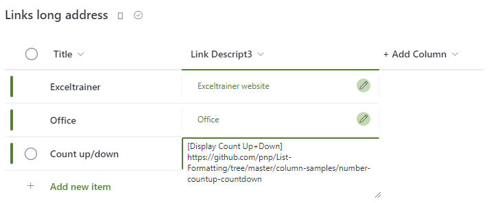

#Hyperlink- long addresses

## Summary
The default hyperlink column has a limited number of characters that can be used, and this will get you into trouble when linking to, for example, OneNote pages or any other link with a lot of parameters.

Using the following code, you can easily turn a “multiple lines of text” column into a useful list with hyperlinks.

## View requirements
- Multi lines of text column
- Links can to be introduced with an alternative text by preceding them with square brackets

## Sample
Solution|Author(s)
--------|---------
Hyperlink-long-address.json | [Geert de Kooter](https://github.com/gdk-max) ([@gdekooter](https://twitter.com/gdekooter)

## Version history
Version|Date|Comments
-------|----|--------
1.0|January 20, 2023|Initial release

## Disclaimer

**THIS CODE IS PROVIDED *AS IS* WITHOUT WARRANTY OF ANY KIND, EITHER EXPRESS OR IMPLIED, INCLUDING ANY IMPLIED WARRANTIES OF FITNESS FOR A PARTICULAR PURPOSE, MERCHANTABILITY, OR NON-INFRINGEMENT.**

---

## Additional notes
Any potential additional notes to get included in the readme around the sample with additional pictures etc.

