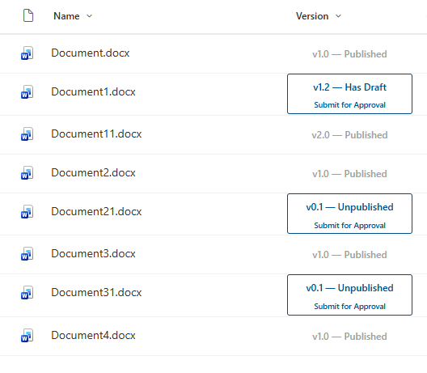

# Version Status and Approval Flow Button

## Summary

Formats a SharePoint version number column (`_UIVersion`) as a combined status badge and approval flow trigger. The entire card is a single clickable element — when a minor version (draft) exists, the card displays the version, its status, and a "Submit for Approval" button. When the item is on a major version (published), the card becomes non-interactive and displays a greyed-out "Published" state.

Status is derived entirely from the version number:
- **Major version** (e.g. `1.0`, `2.0`) → Published — card is grey, non-clickable
- **Minor version > 1** (e.g. `1.2`) → Has Draft — card is blue, flow button shown
- **Minor version ≤ 1** (e.g. `0.1`) → Unpublished — card is blue, flow button shown

## View requirements

- Apply this format to the built-in **Version** column (`_UIVersion`) on a SharePoint document library
- **Major and minor versioning** must be enabled on the library (see [Setup guide](#setup-guide))
- The **Version column must be added to the view** — it is hidden by default (see [Setup guide](#setup-guide))
- A **Power Automate approval flow** must exist and its GUID substituted into the JSON (see [Setup guide](#setup-guide))
- No additional columns are required — the format is entirely self-contained

## Setup guide

### 1. Enable major and minor versioning

This format relies on SharePoint's built-in major/minor versioning to determine document state.

1. Go to your library → **Settings** (gear icon) → **Library settings**
2. Click **Versioning settings**
3. Under **Document Version History**, select **Create major and minor (draft) versions**
4. Under **Draft Item Security**, choose who can see drafts (typically **Only users who can edit**)
5. Optionally enable **Require content approval** if you want formal approval to publish
6. Click **OK**

### 2. Create an approval flow in Power Automate

1. In your SharePoint library, click **Automate** in the toolbar → **Power Automate** → **Create a flow**
2. Choose the **Request sign-off** template, or build a custom approval flow from blank using the **SharePoint - For a selected item** trigger
3. Add an **Approvals - Start and wait for an approval** action with your approvers configured
4. Add a follow-up action to publish the document (e.g. set the item's approval status or promote a minor version to major) on approval
5. Save and test your flow

### 3. Finding your Flow GUID

1. Go to [flow.microsoft.com](https://flow.microsoft.com) and open your approval flow
2. Look at the browser URL — it will contain a segment like `/flows/xxxxxxxx-xxxx-xxxx-xxxx-xxxxxxxxxxxx/`
3. Copy that GUID and replace `YOUR-FLOW-GUID-HERE` in the `actionParams` of the JSON

Alternatively, from the SharePoint library:
1. Click **Automate** → **Power Automate** → **See your flows**
2. Open the flow and copy the GUID from the browser URL

### 4. Show the Version column in your view
 
The built-in Version column is not available in the modern **Show/hide columns** panel — it must be added through the classic view editor.
 
1. Go to your library → **Settings** (gear icon) → **Library settings**
2. Under **Views**, click the view you want to edit (e.g. **All Documents**)
3. In the **Columns** list, tick the checkbox next to **Version**
4. Click **OK** at the bottom of the page

The column will now appear. To apply the format:

1. Click the **Version** column header → **Column settings** → **Format this column**
2. Click **Advanced mode**
3. Paste the contents of `approval-button-drafts.json` (with your Flow GUID substituted) into the editor
4. Click **Save**

## Sample

| Solution | Author(s) |
| --- | --- |
| approval-button-drafts.json | [bianca-git](https://github.com/bianca-git) |

## Version history

| Version | Date | Comments |
| --- | --- | --- |
| 1.0 | April 2026 | Initial release |

## Disclaimer

**THIS CODE IS PROVIDED *AS IS* WITHOUT WARRANTY OF ANY KIND, EITHER EXPRESS OR IMPLIED, INCLUDING ANY IMPLIED WARRANTIES OF FITNESS FOR A PARTICULAR PURPOSE, MERCHANTABILITY, OR NON-INFRINGEMENT.**

