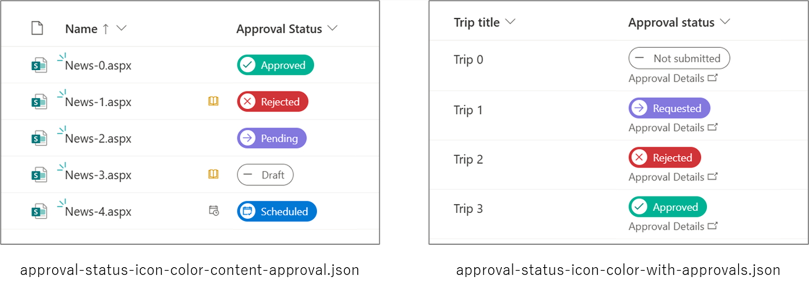
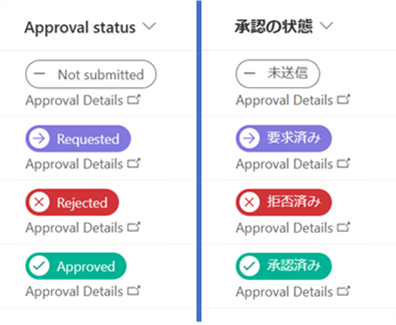
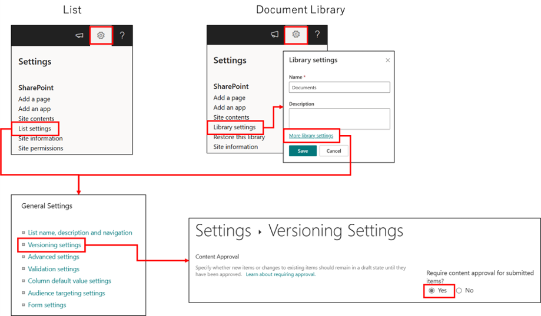
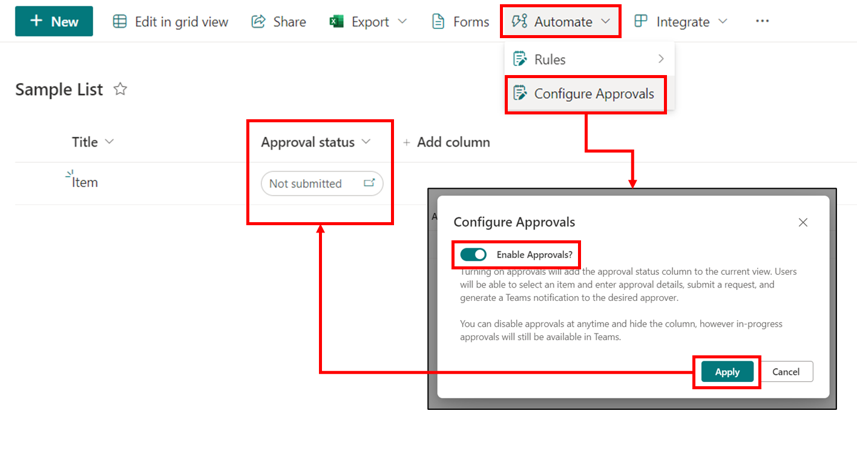
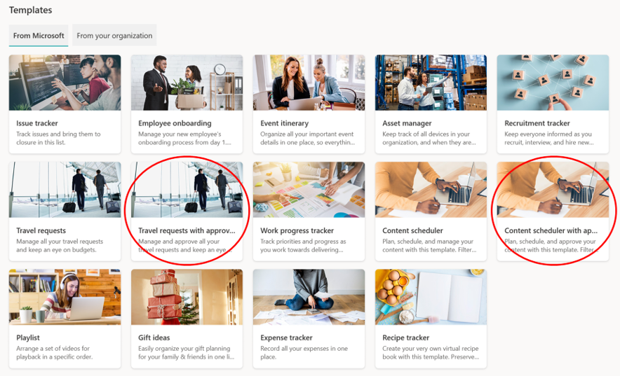
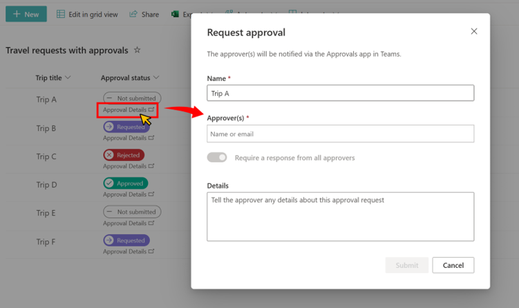

# Approval Status Icons and Colors

## Summary
This sample demonstrates how to change icons and colors based on the value in the Approval Status column. Changing the icon and color for each Approval Status column value allows for a more visual understanding of the status.

The values displayed in Approval Status column are different depending on the display language.

There are also two samples, each described below.

### approval-status-icon-color-content-approval.json

**approval-status-icon-color-content-approval.json** is a sample that can be applied to the Approval Status column with  the internal column name of `_ModerationStatus` when [content approval](https://support.microsoft.com/office/require-approval-of-items-in-a-list-or-library-cd0761c4-8c3f-4ea2-9435-13c28aa23d08) is set as required.

The following table shows the icons and CSS classes for each value in the Approval Status column.

Approval Status  |Icon Name         |Background color related CSS class|
-----------------|------------------|----------------------------------|
0 (Approved)     |Accept            |ms-bgColor-tealLight              |
1 (Rejected)     |Cancel            |ms-bgColor-sharedRed10            |
2 (Pending)      |Forward           |ms-bgColor-sharedBlueMagenta10    |
3 (Draft)        |CalculatorSubtract|ms-bgColor-white                  |
4 (Scheduled)    |EventAccepted     |ms-bgColor-blue                   |

### approval-status-icon-color-with-approvals.json

**approval-status-icon-color-with-approvals.json** is a sample that can be applied to the Approval status column with the internal column name `_ApprovalStatus` created when the [Approvals in Lists](https://support.microsoft.com/office/approvals-in-lists-2bd0954d-5797-4be3-b78a-846f26338e17) feature is enabled.

Since the Approvals in Lists feature is also enabled for the "Travel Request with Approval" and "Content Scheduler with Approval" list templates, this sample is also available for these templates.

The following table shows the icons and CSS classes for each value in the Approval Status column.

Approval Status  |Icon Name         |Background color related CSS class|
-----------------|------------------|----------------------------------|
0 (Not Submitted)|CalculatorSubtract|ms-bgColor-white                  |
1 (Requested)    |Forward           |ms-bgColor-sharedBlueMagenta10    |
2 (Rejected)     |Cancel            |ms-bgColor-sharedRed10            |
3 (Approved)     |Accept            |ms-bgColor-tealLight              |

When you click on "Approval Details," the "Request approval" dialog or the "Approval request details" dialog will appear.

## View requirements

- **approval-status-icon-color-content-approval.json** can be applied to the Approval Status column with  the internal column name of `_ModerationStatus` when content approval is set as required.
- **approval-status-icon-color-with-approvals.json** can be applied to the Approval status column with the internal column name `_ApprovalStatus`, which is created when the Approvals in Lists feature is enabled.

## Sample

Solution|Author(s)
--------|---------
approval-status-icon-color-content-approval.json | [Tetsuya Kawahara](https://github.com/tecchan1107) ([@techan_k](https://twitter.com/techan_k))
approval-status-icon-color-with-approvals.json | [Tetsuya Kawahara](https://github.com/tecchan1107) ([@techan_k](https://twitter.com/techan_k))

## Version history

Version |Date        |Comments
--------|------------|----------------
1.0     |June 4, 2023|Initial release
1.1     |May 22, 2024|Added a note to README.md about the Approvals in Lists feature

## Disclaimer
**THIS CODE IS PROVIDED *AS IS* WITHOUT WARRANTY OF ANY KIND, EITHER EXPRESS OR IMPLIED, INCLUDING ANY IMPLIED WARRANTIES OF FITNESS FOR A PARTICULAR PURPOSE, MERCHANTABILITY, OR NON-INFRINGEMENT.**

---

## Additional notes

- [Approvals in Lists](https://support.microsoft.com/office/approvals-in-lists-2bd0954d-5797-4be3-b78a-846f26338e17) feature has not yet been deployed as of May 22, 2024 and some tenants may not be able to activate the feature.

