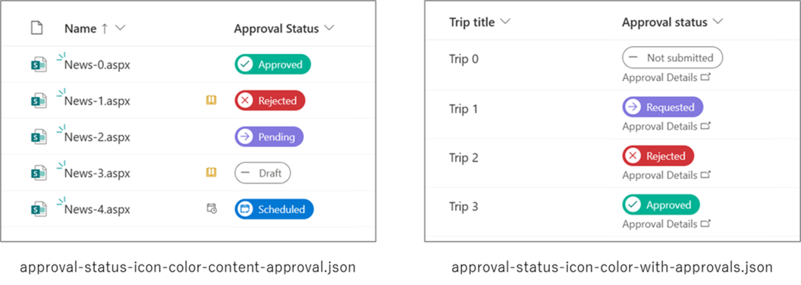

# Icons and colors that change depending on the value in the Approval Status column

## Summary
This sample demonstrates changing the icons and colors depending on the value in the Approval Status column.

The icons and CSS classes for each value in the Approval Status column are shown in the following table.

Approval Status  |Icon Name         |Background color related CSS class|
-----------------|------------------|----------------------------------|
0 (Not Submitted)|CalculatorSubtract|ms-bgColor-white                  |
1 (Requested)    |Forward           |ms-bgColor-sharedBlueMagenta10    |
2 (Rejected)     |Cancel            |ms-bgColor-sharedRed10            |
3 (Approved)     |Accept            |ms-bgColor-tealLight              |

Status values are displayed differently depending on the display language.

Also, clicking on "Approval Details" will bring up a dialog box.

## View requirements

- This format can be applied to the Approval Status column of the "Travel requests with approvals" and "Content scheduler with approvals" in list templates.

    

## Sample

Solution|Author(s)
--------|---------
approval-status-icon-color.json | [Tetsuya Kawahara](https://github.com/tecchan1107) ([@techan_k](https://twitter.com/techan_k))

## Version history

Version |Date        |Comments
--------|------------|----------------
1.0     |June 4, 2023|Initial release

## Disclaimer
**THIS CODE IS PROVIDED *AS IS* WITHOUT WARRANTY OF ANY KIND, EITHER EXPRESS OR IMPLIED, INCLUDING ANY IMPLIED WARRANTIES OF FITNESS FOR A PARTICULAR PURPOSE, MERCHANTABILITY, OR NON-INFRINGEMENT.**

---

## Additional notes

- As of June 4, 2023, the approval feature is currently being rolled out and may not be available to all tenants. (Roadmap ID [100502](https://www.microsoft.com/microsoft-365/roadmap?filters=&searchterms=100502))

