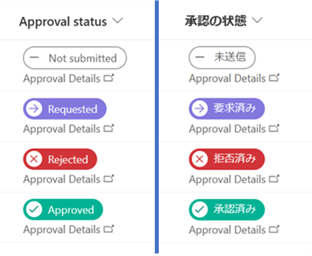

# Approval Status Icons and Colors

## Summary
This sample demonstrates how to change icons and colors based on the value in the Approval Status column.

The values displayed in the Approval Status column vary depending on the display language.

There are also two samples, each described below.

### approval-status-icon-color-content-approval.json

**approval-status-icon-color-content-approval.json** is a sample that can be applied to the Approval Status column with  the internal column name of `_ModerationStatus` when [content approval](https://support.microsoft.com/office/require-approval-of-items-in-a-list-or-library-cd0761c4-8c3f-4ea2-9435-13c28aa23d08) is set as required.

The following table shows the icons and CSS classes for each value in the Approval Status column.

Approval Status  |Icon Name         |Background color related CSS class|
-----------------|------------------|----------------------------------|
0 (Approved)     |Accept            |ms-bgColor-tealLight              |
1 (Rejected)     |Cancel            |ms-bgColor-sharedRed10            |
2 (Pending)      |Forward           |ms-bgColor-sharedBlueMagenta10    |
3 (Draft)        |CalculatorSubtract|ms-bgColor-white                  |
4 (Scheduled)    |EventAccepted     |ms-bgColor-blue                   |

### approval-status-icon-color-with-approvals.json

**approval-status-icon-color-with-approvals.json** is a sample that can be applied to the Approval Status column with the internal column name `_ApprovalStatus` in the list templates "Travel Request with Approval" and "Content Scheduler with Approval".

The following table shows the icons and CSS classes for each value in the Approval Status column.

Approval Status  |Icon Name         |Background color related CSS class|
-----------------|------------------|----------------------------------|
0 (Not Submitted)|CalculatorSubtract|ms-bgColor-white                  |
1 (Requested)    |Forward           |ms-bgColor-sharedBlueMagenta10    |
2 (Rejected)     |Cancel            |ms-bgColor-sharedRed10            |
3 (Approved)     |Accept            |ms-bgColor-tealLight              |

When you click on "Approval Details," the "Request approval" dialog or the "Approval request details" dialog will appear.

## View requirements

- **approval-status-icon-color-content-approval.json** can be applied to the Approval Status column with  the internal column name of `_ModerationStatus` when content approval is set as required.
- **approval-status-icon-color-with-approvals.json** can be applied to the Approval Status column with the internal column name `_ApprovalStatus` in the list templates "Travel Request with Approval" and "Content Scheduler with Approval".

## Sample

Solution|Author(s)
--------|---------
approval-status-icon-color-content-approval.json | [Tetsuya Kawahara](https://github.com/tecchan1107) ([@techan_k](https://twitter.com/techan_k))
approval-status-icon-color-with-approvals.json | [Tetsuya Kawahara](https://github.com/tecchan1107) ([@techan_k](https://twitter.com/techan_k))

## Version history

Version |Date        |Comments
--------|------------|----------------
1.0     |June 4, 2023|Initial release

## Disclaimer
**THIS CODE IS PROVIDED *AS IS* WITHOUT WARRANTY OF ANY KIND, EITHER EXPRESS OR IMPLIED, INCLUDING ANY IMPLIED WARRANTIES OF FITNESS FOR A PARTICULAR PURPOSE, MERCHANTABILITY, OR NON-INFRINGEMENT.**

---

## Additional notes

- As of June 4, 2023, the approval features available in list templates "Travel requests with approvals" and "Content scheduler with approvals" are in the process of being rolled out. Therefore, they may not be available for some tenants. (Roadmap ID [100502](https://www.microsoft.com/microsoft-365/roadmap?filters=&searchterms=100502))

