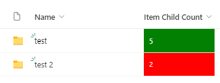

# Change color based on Item Child Count

## Summary
This sample displays the value of the column Item Child Count in green when 5 documents have been uploaded. If less or more then 5 documents are uploaded, the field will be green.

Sample can be extended to different colors or values based on your requirements.

## View requirements
- This format can only be applied to the Item Child Count field. Add this field to your view by clicking on "Add Column" - "Show or hide columns"

## Sample

Solution|Author(s)
--------|---------
childcount-color-change.json | [Marijn Somers](https://github.com/marijnsomers)

## Version history

Version|Date|Comments
-------|----|--------
1.0|February 20, 2023|Initial release

## Disclaimer
**THIS CODE IS PROVIDED *AS IS* WITHOUT WARRANTY OF ANY KIND, EITHER EXPRESS OR IMPLIED, INCLUDING ANY IMPLIED WARRANTIES OF FITNESS FOR A PARTICULAR PURPOSE, MERCHANTABILITY, OR NON-INFRINGEMENT.**

---

## Additional notes

- None

