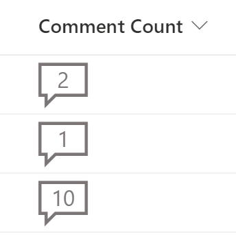

# Comment Count

## Summary
This sample adds a visual indicator to a list item, showing the number of comments present on it. This is achieved by using the built-in [$_CommentCount] reference, which returns the number of comments on the current item.

.  

## View requirements
This can be added on any column, overwriting its contents. You could, e.g., create an empty Single Line of Text column called Comment Count and format it with this sample.

Column Name|Type
--------|---------
Comment Count  | Single Line of Text.

## Sample

Solution|Author(s)
--------|---------
comment-count.json | [Chris Kent](https://github.com/thechriskent) ([@thechriskent](https://twitter.com/thechriskent))

## Version history

Version|Date|Comments
-------|----|--------
1.0|March 19, 2021|Initial release
2.0|August 20, 2021|Added readme

## Disclaimer
**THIS CODE IS PROVIDED *AS IS* WITHOUT WARRANTY OF ANY KIND, EITHER EXPRESS OR IMPLIED, INCLUDING ANY IMPLIED WARRANTIES OF FITNESS FOR A PARTICULAR PURPOSE, MERCHANTABILITY, OR NON-INFRINGEMENT.**

---

## Additional notes

