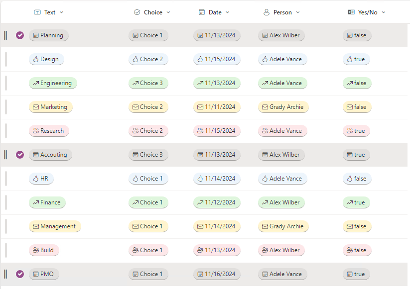

# Cycle Pill Styles

## Summary

This sample demonstrates how colors and icons change according to row index, regardless of column value. The formatting cycles styles every 5 rows. It can be used for filtering lists and libraries. Inspired by Ganesh Sanap's Work Progress Category Pill sample.

## View requirements

This sample works with many column types, for other columns like Person needs to update `"txtContent": "@currentField.title"`.

## Sample

Solution|Author(s)
--------|---------
cycle-pill-styles.json | [Watana](https://github.com/watana2)

## Version history

Version|Date|Comments
-------|----|--------
1.0 | November 13, 2024 | Initial release

## Disclaimer

**THIS CODE IS PROVIDED *AS IS* WITHOUT WARRANTY OF ANY KIND, EITHER EXPRESS OR IMPLIED, INCLUDING ANY IMPLIED WARRANTIES OF FITNESS FOR A PARTICULAR PURPOSE, MERCHANTABILITY, OR NON-INFRINGEMENT.**

