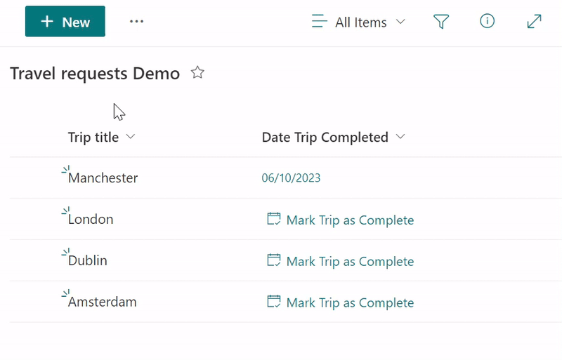

# Set Date to Today's Date (Date Only)

## Summary
This sample a button to 'Mark Trip as Complete' (Date Field). 
This button uses the 'setValue' action to set a Date field value to Today's date by using the token @now and formatting it in a way that we exclude the time piece (a string in the format ‘yyyy-MM-dd’).

## View requirements

|Type|Internal Name|Required|Additional Information
|---|---|:---:|---|
|Date Only|DateTripCompleted|Yes| Apply [date-button-setValue-today.json](./date-button-setValue-today.json) to this column

## Sample

Solution|Author(s)
--------|---------
date-button-setValue-today.json | [Michel Mendes](https://github.com/michelcarlo) [(@michelcarlo)](https://twitter.com/michelcarlo)

## Version history

Version |Date          |Comments
--------|--------------|--------------------------------
1.0     |January 15, 2023 |Initial release

## Disclaimer
**THIS CODE IS PROVIDED *AS IS* WITHOUT WARRANTY OF ANY KIND, EITHER EXPRESS OR IMPLIED, INCLUDING ANY IMPLIED WARRANTIES OF FITNESS FOR A PARTICULAR PURPOSE, MERCHANTABILITY, OR NON-INFRINGEMENT.**
##

