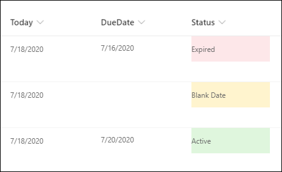

# Formatting a column when a date column is blank

## Summary
This example populates the text content and applies different classes to the Status field depending on the value inside an item's DueDate field. This example applies formatting to one field by looking at the value inside another field. Note that DueDate is referenced using the `[$FieldName]` syntax. FieldName is assumed to be the internal name of the field. This example also takes advantage of a special value that can be used in date/time fields - `@now`, which resolves to the current date/time, evaluated when the user loads the list view.

The text content and classes applied are determined based on following conditions:

|Condition|txtContent|Class|
|---|---|---|
|DueDate is blank|Blank Date|sp-field-severity--warning|
|DueDate < Now|Expired|sp-field-severity--blocked|
|Else|Active|sp-field-severity--good|

## View requirements
- This format can be applied to a Single line of text or Choice column
- An additional DateTime column with an internal name of `DueDate`

## Sample

Solution|Author(s)
--------|---------
date-check-blank-format.json | [Ganesh Sanap](https://github.com/ganesh-sanap) ([@ganeshsanap20](https://twitter.com/ganeshsanap20))

## Version history

Version|Date|Comments
-------|----|--------
1.0|July 18, 2020|Initial release

## Disclaimer
**THIS CODE IS PROVIDED *AS IS* WITHOUT WARRANTY OF ANY KIND, EITHER EXPRESS OR IMPLIED, INCLUDING ANY IMPLIED WARRANTIES OF FITNESS FOR A PARTICULAR PURPOSE, MERCHANTABILITY, OR NON-INFRINGEMENT.**

---

## Additional notes
This sample uses some predefined classes also covered in the official documentation of Column Formatting:

- [Use column formatting to customize SharePoint - Style guidelines](https://docs.microsoft.com/en-us/sharepoint/dev/declarative-customization/column-formatting#style-guidelines)

