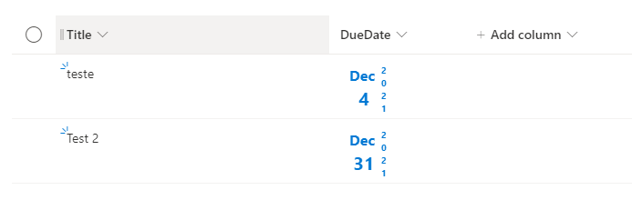

# Formatting of Date column to compress date value in different style.

## Summary
This sample provide a different style to provide Date in a compress way such us align days and month and display year parallel as vertical.

## View requirements
- This format can be applied to any date time `Column`

## Sample

Solution|Author(s)
--------|---------
date-compress-format.json | [André Lage](https://github.com/aaclage) ([@aaclage](https://twitter.com/aaclage))

## Version history

Version|Date|Comments
-------|----|--------
1.0|December 6, 2021|Initial release

## Disclaimer
**THIS CODE IS PROVIDED *AS IS* WITHOUT WARRANTY OF ANY KIND, EITHER EXPRESS OR IMPLIED, INCLUDING ANY IMPLIED WARRANTIES OF FITNESS FOR A PARTICULAR PURPOSE, MERCHANTABILITY, OR NON-INFRINGEMENT.**

