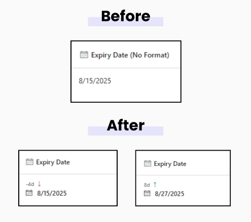

# Days Counter

## Summary  
Shows how many days are left until a date or how many days have passed since a date, right inside a SharePoint list column. Color-coded for quick scanning.\
\

## View requirements
This format can be applied to any column type but expects the following columns to be part of the view:

|Type   |Internal Name |Required|
|-------|--------------|:------:|
|DateTime |Any           |Yes     |

## Sample
Solution|Author(s)
--------|---------
date-day-counter.json | [Tanel Vahk](https://github.com/tvahk)

## Version history
Version |Date             |Comments
--------|-----------------|--------------------------------
1.0     |August 19, 2025 |Initial release

## Disclaimer
**THIS CODE IS PROVIDED *AS IS* WITHOUT WARRANTY OF ANY KIND, EITHER EXPRESS OR IMPLIED, INCLUDING ANY IMPLIED WARRANTIES OF FITNESS FOR A PARTICULAR PURPOSE, MERCHANTABILITY, OR NON-INFRINGEMENT.**