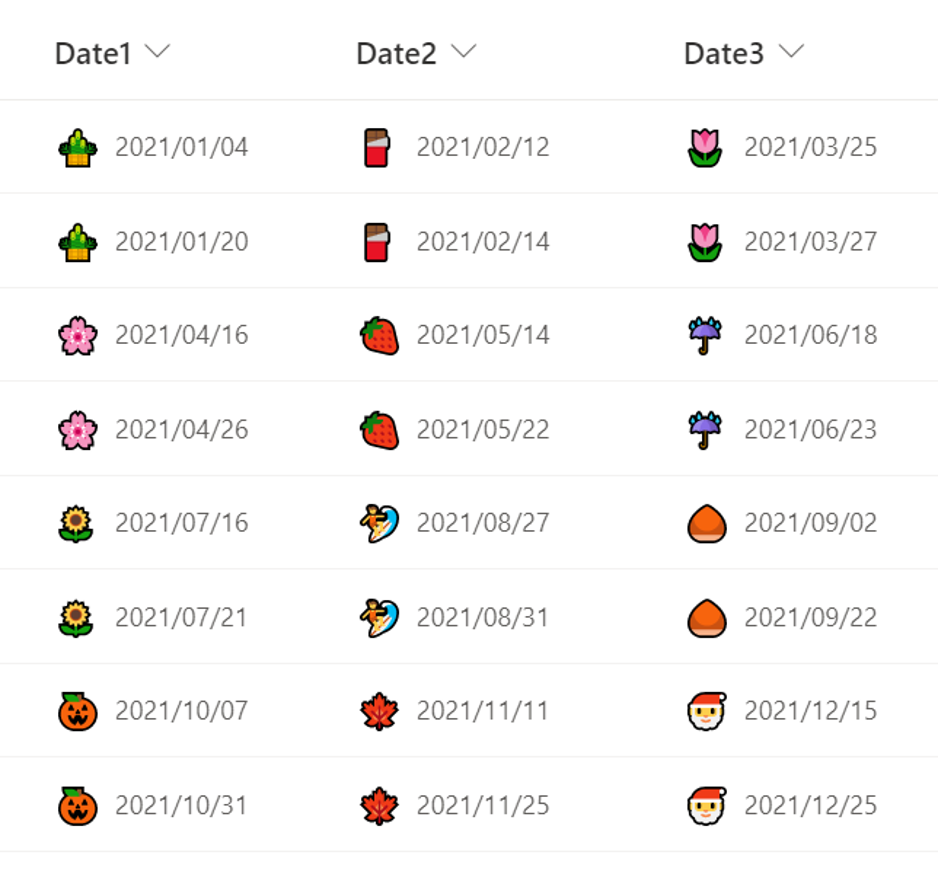

# Monthly Emoji

## Summary
This sample demonstrates how to display a emoji representing the month of the date to the left of the date.

The correspondence between the months and emoji in this sample is as follows:

Month     |Emoji
----------|------
January   |🎍
February  |🍫
March     |🌷
April     |🌸
May       |🍓
June      |☔
July      |🌻
August    |🏄
September |🌰
October   |🎃
November  |🍁
December  |🎅

## View requirements
This format can be applied to a Date column

## Sample

Solution|Author(s)
--------|---------
date-monthly-emoji.json | [Tetsuya Kawahara](https://github.com/tecchan1107)

## Version history

Version |Date             |Comments
--------|-----------------|--------
1.0     |October 17, 2021 |Initial release

## Disclaimer
**THIS CODE IS PROVIDED *AS IS* WITHOUT WARRANTY OF ANY KIND, EITHER EXPRESS OR IMPLIED, INCLUDING ANY IMPLIED WARRANTIES OF FITNESS FOR A PARTICULAR PURPOSE, MERCHANTABILITY, OR NON-INFRINGEMENT.**

