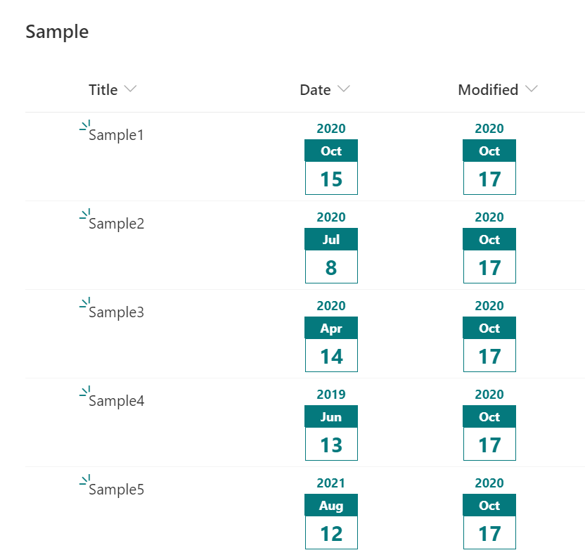

# Page-a-day Calender

## Summary
This sample is to customize a date column to look like page-a-day calendar.

## View requirements
This format can be applied to a Date column

## Sample

Solution                      |Author(s)
------------------------------|---------------------------
date-page-a-day-calender.json |  [Tetsuya Kawahara](https://twitter.com/techan_k)

## Version history

Version |Date             |Comments
--------|-----------------|--------
1.0     |October 17, 2020 |Initial release

## Disclaimer
**THIS CODE IS PROVIDED *AS IS* WITHOUT WARRANTY OF ANY KIND, EITHER EXPRESS OR IMPLIED, INCLUDING ANY IMPLIED WARRANTIES OF FITNESS FOR A PARTICULAR PURPOSE, MERCHANTABILITY, OR NON-INFRINGEMENT.**

