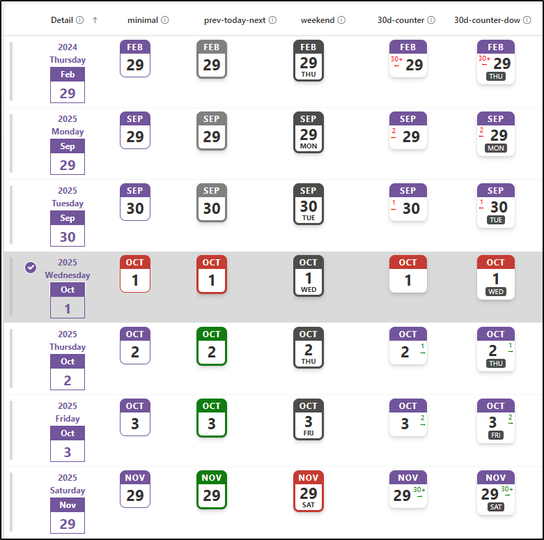

# Page-a-day Calendar

## Summary
This sample customizes a date column to look like a page-a-day calendar. It does this by using the date part functions (`getDate`, `getMonth`, and `getYear`). The days of the week are displayed using Zeller's congruence.

## View requirements
This format can be applied to a Date column.

## Sample

Solution|Author(s)
--------|---------
date-page-a-day-calendar.json | [Tetsuya Kawahara](https://github.com/tecchan1107) ([@techan_k](https://twitter.com/techan_k))
date-page-a-day-calendar-rounded.json | [Watana](https://github.com/watana2)
date-page-a-day-calendar-color.json | [Watana](https://github.com/watana2)

## Version history

Version |Date             |Comments
--------|-----------------|--------
1.0     |October 17, 2020 |Initial release
1.1     |August  2, 2021  |Fixed to show days of the week.
1.2     |October 2, 2022  |Fixed incorrect days of the week being displayed.
1.3     |December 13, 2024|Added `date-page-a-day-calendar-rounded.json`
1.4     |December 14, 2024|Adjusted the layout for `date-page-a-day-calendar.json` to ensure that the day-of-the-week text, which was partially hidden due to the update, is now visible.
1.5     |September 1, 2025|Added  `date-page-a-day-calendar-color.json`

## Disclaimer
**THIS CODE IS PROVIDED *AS IS* WITHOUT WARRANTY OF ANY KIND, EITHER EXPRESS OR IMPLIED, INCLUDING ANY IMPLIED WARRANTIES OF FITNESS FOR A PARTICULAR PURPOSE, MERCHANTABILITY, OR NON-INFRINGEMENT.**

## Additional notes
- [Zeller's congruence](https://en.wikipedia.org/wiki/Zeller%27s_congruence)

