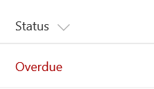

# Formatting an item when a date column is before or after today's date

## Summary
This example colors the current field red when the value inside an item's DueDate is before the current date/time. Unlike some of the previous examples, this example applies formatting to one field by looking at the value inside another field. Note that DueDate is referenced using the [$FieldName] syntax. FieldName is assumed to be the internal name of the field. This example also takes advantage of a special value that can be used in date/time fields - `@now`, which resolves to the current date/time, evaluated when the user loads the list view.

> Although the color can be specified directly in a style property, the [UI Fabric](https://developer.microsoft.com/en-us/fabric#/styles/colors) `ms-fontColor-redDark` class is used to ensure the color matches the defined Office styles.

## View requirements
- This format can be applied to any column type
- An additional DateTime column with an internal name of `DueDate`

## Sample

Solution|Author(s)
--------|---------
date-range-format.json | [SharePoint Team](https://github.com/SharePoint) ([@m365dev](https://twitter.com/m365dev))

## Version history

Version|Date|Comments
-------|----|--------
1.0|November 2, 2017|Initial release
1.1|March 22, 2018|Minor color adjustment
1.2|August 17, 2018|Changed color from style to class and switched to Excel-style expressions

## Disclaimer
**THIS CODE IS PROVIDED *AS IS* WITHOUT WARRANTY OF ANY KIND, EITHER EXPRESS OR IMPLIED, INCLUDING ANY IMPLIED WARRANTIES OF FITNESS FOR A PARTICULAR PURPOSE, MERCHANTABILITY, OR NON-INFRINGEMENT.**

---

## Additional notes
This sample is also covered in the main documentation around Column Formatting

- [Use column formatting to customize SharePoint](https://docs.microsoft.com/en-us/sharepoint/dev/declarative-customization/column-formatting)

> An additional version using Abstract Tree Syntax (AST) is also provided for environments where the Excel-style expressions are not supported.

