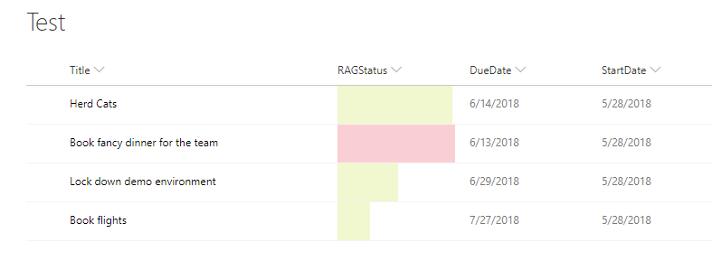

# Creating RAG (Red/Amber/Green) bars based on date ranges.

## Summary
This example creates colored data bars on the current field based on a DueDate and StartDate fields and the current date/time.  The bar fills towards 100% as "Today" approaches the due date.  A percentage width is determined based on the total number of days between the StartDate of the item and the DueDate of the item.  Some additional work can (and probably should) be done to set a bar to amber 

Unlike some of the other examples, this one applies formatting to one field by looking at the value inside another field. Note that DueDate and StartDate is referenced using the [$FieldName] syntax. FieldName is assumed to be the internal name of the field. This example also takes advantage of a special value that can be used in date/time fields - `@now`, which resolves to the current date/time, evaluated when the user loads the list view.

## Sample

Solution|Author(s)
--------|---------
date-range-format.json | Christopher Parker

## Version history

Version|Date|Comments
-------|----|--------
1.0|13 June 2018|Initial release

## Disclaimer
**THIS CODE IS PROVIDED *AS IS* WITHOUT WARRANTY OF ANY KIND, EITHER EXPRESS OR IMPLIED, INCLUDING ANY IMPLIED WARRANTIES OF FITNESS FOR A PARTICULAR PURPOSE, MERCHANTABILITY, OR NON-INFRINGEMENT.**
