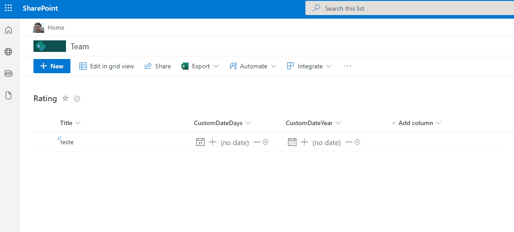

# date update format

## Summary
This sample includes format to manage date in view column with follow options, include icon option to add today's date, add or reduce by day or year and icon to clear date.

## View requirements
- The format expect the following fields:

Field |Type
--------|---------
Title | Single line of text 
CustomDate | Date and Time - Manage Date by day
CustomDateYear | Date and Time - Manage Date by year

## Sample

Solution|Author(s)
--------|---------
[date-days-format.json](./date-days-format.json) | [André Lage](https://twitter.com/aaclage)
[date-years-format.json](./date-years-format.json) | [André Lage](https://twitter.com/aaclage)

## Version history

Version|Date|Comments
-------|----|--------
1.0|December 09, 2021|Initial release

## Disclaimer
**THIS CODE IS PROVIDED *AS IS* WITHOUT WARRANTY OF ANY KIND, EITHER EXPRESS OR IMPLIED, INCLUDING ANY IMPLIED WARRANTIES OF FITNESS FOR A PARTICULAR PURPOSE, MERCHANTABILITY, OR NON-INFRINGEMENT.**

