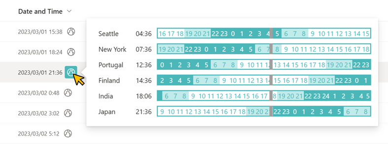

# World Time

## Summary

This sample demonstrates displaying the times of countries and regions of the world for a date column value that includes the time.



- The countries and regions to display can be added or removed by editing the string of the first argument of the `split` operator on line 45. The following notes apply to editing that string.
    - The string must be `[time difference from UTC]|[name of country or region]` separated by commas.
    - If you want to use spaces for the country or region name, use - (half-width hyphen). The - (half-width hyphen) will be replaced with a half-width space and displayed on the screen. Including spaces in the string will prevent the custom card from displaying.

- Here is an example of the settings for line 45:
    ```
    "forEach": "UTC in split('-8|Seattle,-5|New-York,0|Portugal,2|Finland,5.5|India,9|Japan',',')",
    ```

## View requirements

This format can be applied to a Date column.

## Sample

Solution|Author(s)
--------|---------
date-world-time.json | [Tetsuya Kawahara](https://github.com/tecchan1107) ([@techan_k](https://twitter.com/techan_k))

## Version history

Version |Date          |Comments
--------|--------------|--------
1.0     |March 3, 2023 |Initial release

## Disclaimer

**THIS CODE IS PROVIDED *AS IS* WITHOUT WARRANTY OF ANY KIND, EITHER EXPRESS OR IMPLIED, INCLUDING ANY IMPLIED WARRANTIES OF FITNESS FOR A PARTICULAR PURPOSE, MERCHANTABILITY, OR NON-INFRINGEMENT.**

