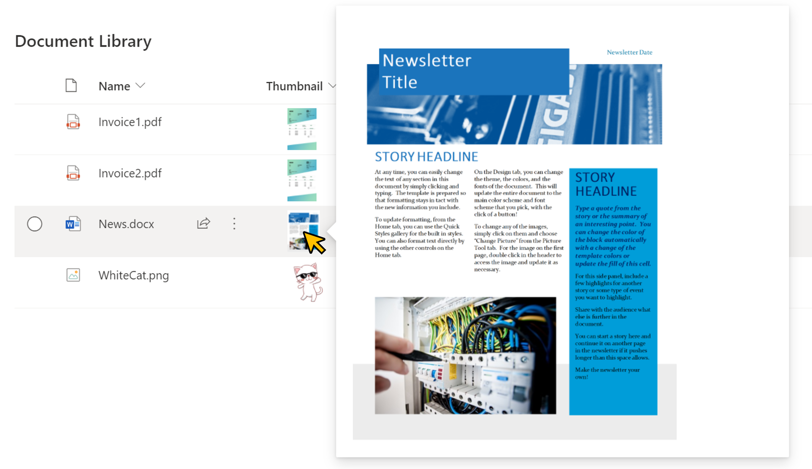

# File Thumbnails

## Summary
This sample utilizes the `@thumbnail` placeholder token to create an inline preview for document libraries. Folders and filetypes where previews are not available will not display at all.

`file-thumbnail-lightbox.json` displays enlarged thumbnails in a lightbox. This sample is derived from [image-lightbox](https://github.com/pnp/List-Formatting/tree/master/column-samples/image-lightbox).

>Note - the automatic removal of the `img` element when dealing with folders or filetypes where previews are not available requires that properties of the `img` element do not use expressions.

## View requirements
This can be added on any column in a document library, overwriting its contents.

## Sample

Solution|Author(s)
--------|---------
file-thumbnail.json | [Chris Kent](https://github.com/thechriskent) ([@thechriskent](https://twitter.com/thechriskent))
file-thumbnail-lightbox.json | [Tetsuya Kawahara](https://github.com/tecchan1107) ([@techan_k](https://twitter.com/techan_k))

## Version history

Version|Date|Comments
-------|----|--------
1.0|May 27, 2019|Initial release
1.1|July 4, 2021|Added file-thumbnail-lightbox.json

## Disclaimer
**THIS CODE IS PROVIDED *AS IS* WITHOUT WARRANTY OF ANY KIND, EITHER EXPRESS OR IMPLIED, INCLUDING ANY IMPLIED WARRANTIES OF FITNESS FOR A PARTICULAR PURPOSE, MERCHANTABILITY, OR NON-INFRINGEMENT.**

---

## Additional notes

- SharePoint Online only

