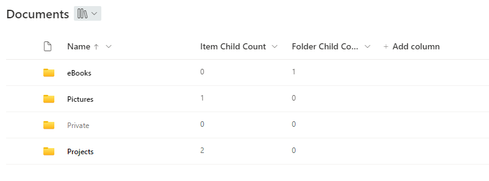
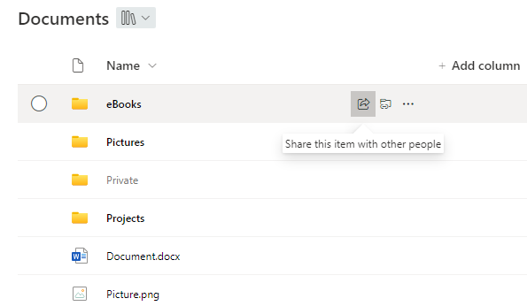

# Highlight non-empty folder

## Summary
This sample shows how folders can be highlighted or grayed out depending on whether they are empty or not.
It uses the 'Folder Child Count' and 'Item Child Count' columns to check if a folder is empty or not.

**Update**

Added a second version ([filename-highlight-non-empty-folders-with-buttons.json](./filename-highlight-non-empty-folders-with-buttons.json)) which brings back the buttons and functions a vanilla name column has. It's possible to share the folder and to open the context menu.

Unfortunately, customRowAction doesn't support creating a shortcut to OneDrive yet. Therefore the 'OneDrive' button is only a placeholder which points out an alternative to create a shortcut. Clicking the button itself has no effect.

> Note - The sample can be easily adjusted to support only one of the columns. Just delete or replace the '||' and the according column in the json file

## View requirements
- This format can be applied to Name column in a document library

## Sample

Solution|Author(s)
--------|---------
filename-highlight-non-empty-folders.json | [Moritz Lickert](https://github.com/MoeIcI)
filename-highlight-non-empty-folders-with-buttons.json | [Moritz Lickert](https://github.com/MoeIcI)

## Version history

Version|Date|Comments
-------|----|--------
1.0|October 6, 2023|Initial release
2.0|January 24, 2024|Included 2nd version with Buttons

## Disclaimer
**THIS CODE IS PROVIDED *AS IS* WITHOUT WARRANTY OF ANY KIND, EITHER EXPRESS OR IMPLIED, INCLUDING ANY IMPLIED WARRANTIES OF FITNESS FOR A PARTICULAR PURPOSE, MERCHANTABILITY, OR NON-INFRINGEMENT.**

---

