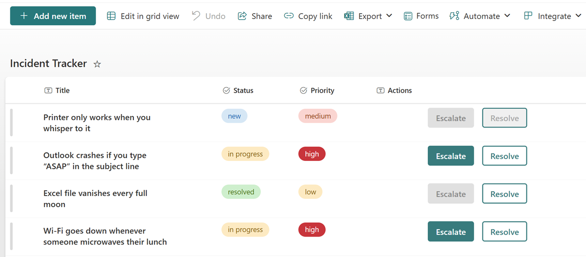

# Incident Action Buttons

## Summary

This sample adds two context-aware buttons to a SharePoint list for managing incident workflows directly from the list view. It uses column formatting and the `executeFlow` action to provide inline **Escalate** and **Resolve** buttons that trigger Power Automate flows.

Key points:

- The **Escalate** button is only enabled when `Priority` is set to `high`
- The **Resolve** button is disabled when the `Status` is still `new`
- Both buttons are styled using inline JSON and provide a more app-like interaction in SharePoint
- Uses `executeFlow` actions to launch Power Automate flows for escalation and resolution handling

## View requirements

|Type|Internal Name|Required|Additional Information|
|---|---|:---:|---|
|Choice|Priority|Yes|Values: `low`, `medium`, `high` (all lowercase)|
|Choice|Status|Yes|Values: `new`, `in progress`, `resolved` (all lowercase)|
|Single line of text|Actions|Yes|Apply [generic-action-buttons.json](./generic-action-buttons.json) to this column|

- The format is best applied to a dedicated Actions column (type: Single line of text) that exists solely for button rendering.

## Sample

Solution|Author(s)
--------|---------
generic-action-buttons.json | [Luise Freese](https://github.com/LuiseFreese)

## Version history

Version |Date          |Comments
--------|--------------|--------
1.0     |2025-07-16    |Initial release

## Disclaimer
**THIS CODE IS PROVIDED *AS IS* WITHOUT WARRANTY OF ANY KIND, EITHER EXPRESS OR IMPLIED, INCLUDING ANY IMPLIED WARRANTIES OF FITNESS FOR A PARTICULAR PURPOSE, MERCHANTABILITY, OR NON-INFRINGEMENT.**

##

