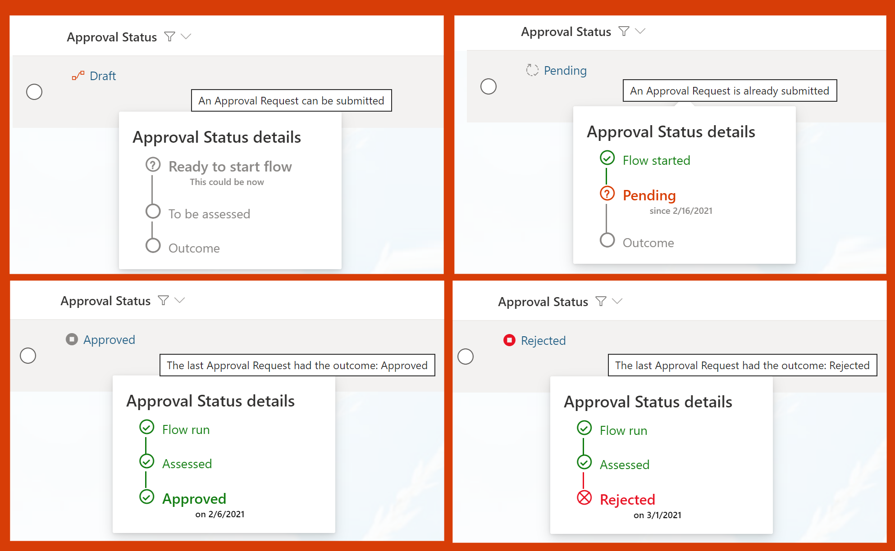

# Approval Status Hover Card

## Summary
This sample provides more detail on list/library items when the standard Conent Approval flow is enabled. The approval status and a related icon/color are shown with additional details about the overall process visible in a panel on hover.

## View requirements
This format requires Content Approval to be enabled for your list/library (see below for instructions). Once enabled, this format can be applied to any column in your view as long as the Approval Status column ([$_ModerationStatus]) and the Modified column ([$Modified]) are also visible in the same view.

### Enable Content Approval
On your list use the menu to choose Integrate > Power Automate > Configure flows. In the panel that opens, choose to enable approvals for the library and choose Content approval for the approval mode.

In the Add column menu choose to Show/hide columns and add Approval Status and Modified to your view.

## Sample

Solution|Author(s)
--------|---------
approval-status-hover-card.json | [Django Lohn](https://twitter.com/LohnDjango)

## Version history

Version|Date|Comments
-------|----|--------
1.0|March 19, 2021|Initial release

## Disclaimer
**THIS CODE IS PROVIDED *AS IS* WITHOUT WARRANTY OF ANY KIND, EITHER EXPRESS OR IMPLIED, INCLUDING ANY IMPLIED WARRANTIES OF FITNESS FOR A PARTICULAR PURPOSE, MERCHANTABILITY, OR NON-INFRINGEMENT.**

---

## Additional notes
This sample uses icons from Fluent UI

- [Fluent UI Iconography](https://developer.microsoft.com/fluentui#/styles/web/icons)