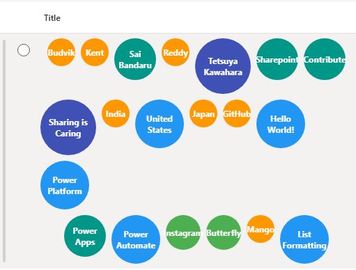

# Bubble Chart

This sample demonstrates how to use **SharePoint Column Formatting** to create a dynamic **bubble chart** in a list view. The size and color of each bubble are automatically determined by the length of the text in its corresponding column, providing a quick visual representation of your data.

### Sample Overview

  * The bubble size and color are dynamically generated.
  * A wider range of sizes and colors is supported for a more vibrant appearance.
  * The bubbles are arranged into a multi-line layout to prevent horizontal crowding.
  * The text within each bubble is horizontally and vertically centered, even when it wraps to multiple lines.

### View Requirements

Create a SharePoint list with the following columns:

| Column Name | Type |
|-------------|-------------|
| Title     | Single Line of Text |
| LABEL1    | Single Line of Text |
| LABEL2    | Single Line of Text |
| LABEL3    | Single Line of Text |
| LABEL4    | Single Line of Text |
| LABEL5    | Single Line of Text |
| LABEL6    | Single Line of Text |
| LABEL7    | Single Line of Text |
| LABEL8    | Single Line of Text |
| LABEL9    | Single Line of Text |
| LABEL10   | Single Line of Text |
| LABEL11   | Single Line of Text |
| LABEL12   | Single Line of Text |
| LABEL13   | Single Line of Text |
| LABEL14   | Single Line of Text |
| LABEL15   | Single Line of Text |
| LABEL16   | Single Line of Text |
| LABEL17   | Single Line of Text |
| LABEL18   | Single Line of Text |
| LABEL19   | Single Line of Text |
| LABEL20   | Single Line of Text |

The formatting code will apply to the column containing the JSON and reference these other columns to create the complete visual.

## How to Apply

1. Open your **SharePoint list**.
2. Click the column header you want to format → **Column settings → Format this column**.
3. Switch to **Advanced mode**.
4. Paste the JSON provided in this project into the formatting editor.
5. Click **Save**. The column will render as a word cloud automatically.

### How It Works

The bubble chart is created using a single JSON file that applies to a column in your SharePoint list. The key parts of the code are:

  * **Dynamic Sizing:** The `width` and `height` of each bubble are set using nested `if` statements that evaluate the length of the text in the corresponding `LABEL` column. This creates a range of sizes, from a small 30px bubble to a large 120px bubble.
  * **Conditional Coloring:** The `background-color` property is also controlled by the text length, with a different color assigned to each size range.
  * **Multi-line Layout:** The bubbles are grouped into separate `div` elements to force them to wrap onto multiple lines, creating a clean, organized layout.

### Solution

| Solution | Author |
| --- | --- |
| generic-bubble-chart.json | [Sai Bandaru](https://github.com/saiiiiiii) ([LinkedIn](https://www.linkedin.com/in/sai-bandaru-97a946153/)) |

### Version History

| Version | Date            | Comments       |
|---------|-----------------|----------------|
| 1.0     | September 2, 2025 | Initial release |

### Disclaimer

**THIS CODE IS PROVIDED *AS IS* WITHOUT WARRANTY OF ANY KIND, EITHER EXPRESS OR IMPLIED, INCLUDING ANY IMPLIED WARRANTIES OF FITNESS FOR A PARTICULAR PURPOSE, MERCHANTABILITY, OR NON-INFRINGEMENT.**

-----

### Additional Notes

  * You can easily customize the bubble sizes, colors, and the number of rows by editing the JSON code.

## References

- [SharePoint Column Formatting Documentation](https://learn.microsoft.com/sharepoint/dev/declarative-customization/column-formatting)
- [JSON Schema for SharePoint Column Formatting](https://developer.microsoft.com/json-schemas/sp/v2/column-formatting.schema.json)

