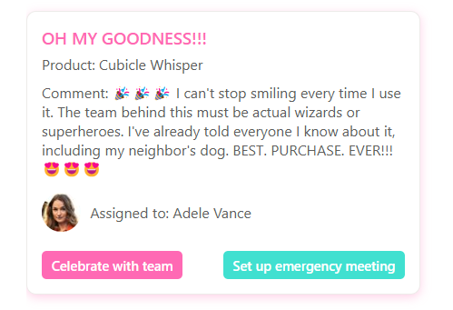

# Card with generic buttons

## Summary

This is a sample that enables you to show content of various columns (single line of text, person) in a modern card design. It also shows two buttons that can call Power Automate flows for actions like sending emails or scheduling meetings in the context of the list or the list item.

This blog post explains the Power Automate flows in detail: [How to apply modern card design in a SharePoint list with listformatting](https://www.m365princess.com/blogs/sp-card/)

## View requirements

- This format can be applied to any column type
- It assumes columns `Title`, `Product`, `Assigned to`, `Comment` - please adjust to your needs
- It also gives you the option to define a fallback image in case the person in the `Assigned to` column has no profile picture.

## Sample

Solution|Author(s)
--------|---------
generic-card-with-buttons.json | [Luise Freese](https://github.com/luisefreeset) ([@LuiseFreese](https://twitter.com/LuiseFReese))

## Version history

Version|Date|Comments
-------|----|--------
1.0|October 14, 2024|Initial release

## Disclaimer

**THIS CODE IS PROVIDED *AS IS* WITHOUT WARRANTY OF ANY KIND, EITHER EXPRESS OR IMPLIED, INCLUDING ANY IMPLIED WARRANTIES OF FITNESS FOR A PARTICULAR PURPOSE, MERCHANTABILITY, OR NON-INFRINGEMENT.**

---

## Additional notes

None

