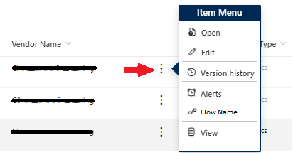

# Context Menu

## Summary

The sample is a simple version of the current context menu. It allows you to customize the menu options and link to the most user of visited links. You can add links to Flows, web pages, or other items specific the the item it is on. It can be added to any customizable field, but adding it to the Title field helps eliminate confusion.

## View requirements

This format can be applied to any column type.

## Sample

Solution|Author(s)
--------|---------
generic-context-menu.json | [Larry Pfaff](https://github.com/jaxkookie) ([@jaxkookie](https://twitter.com/jaxkookie))

## Version history

Version |Date          |Comments
--------|--------------|--------------------------------
1.0     |March 14, 2024 |Initial release

## Disclaimer

**THIS CODE IS PROVIDED *AS IS* WITHOUT WARRANTY OF ANY KIND, EITHER EXPRESS OR IMPLIED, INCLUDING ANY IMPLIED WARRANTIES OF FITNESS FOR A PARTICULAR PURPOSE, MERCHANTABILITY, OR NON-INFRINGEMENT.**

