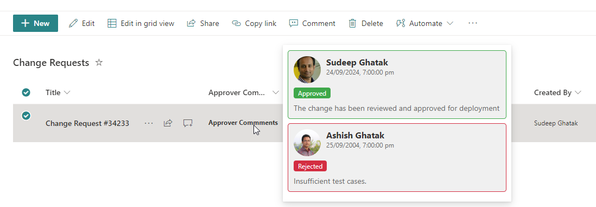

# Custom Approver Hover Card (Column)

## Summary
The approval hover card provides an intuitive, streamlined way for users to quickly access key details about an approval details without navigating away from their current task or screen. 

## View requirements
- This format can be applied to any column type. In the example it has been applied on **ApproverComments** - 

| Internal Name            | Type                | Notes                                                       |
|--------------------------|---------------------|-------------------------------------------------------------|
| Title                    | Single line of text |                                                             |
| Approver1Comments        | Single line of text |                                                             |
| Approver2Comments        | Single line of text |                                                             |
| Approver1Response        | Choice              | "Approved","Rejected","Pending"                             |
| Approver2Response        | Choice              | "Approved","Rejected","Pending"                             |
| Approver1                | Person or Group     |                                                             |
| Approver2                | Person or Group     |                                                             |
| Approver1RespondedOn     | Date and Time       |                                                             |
| Approver2RespondedOn     | Date and Time       |                                                             |
| ApproverComments         | Single line of text |                                                             |

## Sample

Solution|Author(s)
--------|---------
custom-hover-card-approvers.json | [Sudeep Ghatak](https://github.com/sudeepghatak)

## Version history

Version|Date|Comments
-------|----|--------
1.0|September 24, 2024|Initial release

## Disclaimer
**THIS CODE IS PROVIDED *AS IS* WITHOUT WARRANTY OF ANY KIND, EITHER EXPRESS OR IMPLIED, INCLUDING ANY IMPLIED WARRANTIES OF FITNESS FOR A PARTICULAR PURPOSE, MERCHANTABILITY, OR NON-INFRINGEMENT.**

---

