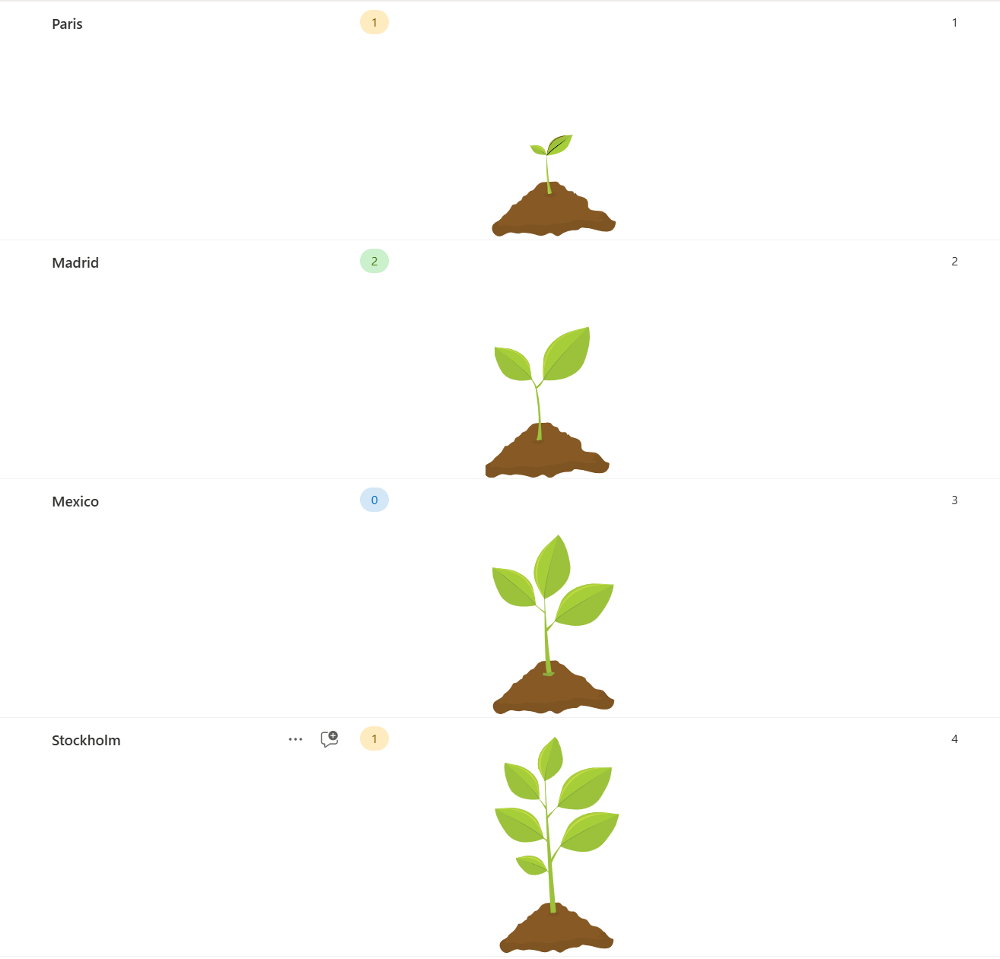

# Format a number column with multi-path SVGs

## Summary

This formats applies different SVGs with multiple paths to a number field, depending on the value of the field. The field may contain the numbers `1`, `2`, `3`, or `4`.

This solution provides a visually appealing way to represent progress using custom SVG graphics. The formatting dynamically changes the displayed SVG based on the value in a "Progress" column.

## Features

* Custom SVG graphics for different progress stages
* Dynamic display based on a "Progress" field value
* Supports up to 4 different progress stages
* Easily customizable SVG paths and colors

The sample includes conditional formatting that displays different SVGs based on the value in the "Progress" column:

| Value| Stage |
|----------|----------|
|Progress value 1   | Displays the first stage SVG |
| Progress value 2   |  Displays the second stage SVG  |
| Progress value 3  |  Displays the third stage SVG  |
|Progress value 4  | VDisplays the fourth stage SVG  |

If the Progress field is empty or has any other value, no SVG will be displayed.

## View requirements

- This format can be applied to a any column

## Sample

Solution|Author(s)
--------|---------
generic-data-plant.json | [Luise Freese](https://twitter.com/LuiseFreese)

## Version history

Version|Date|Comments
-------|----|--------
1.0|October 8, 2024|Initial release

## Disclaimer
**THIS CODE IS PROVIDED *AS IS* WITHOUT WARRANTY OF ANY KIND, EITHER EXPRESS OR IMPLIED, INCLUDING ANY IMPLIED WARRANTIES OF FITNESS FOR A PARTICULAR PURPOSE, MERCHANTABILITY, OR NON-INFRINGEMENT.**

