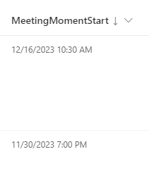
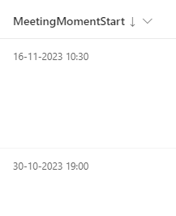

# Date Notation

## Summary
This sample provides a way to make sure that the notation of a date and time column in SharePoint is forced in a specific notation.
In Power Apps we can use Power Fx: 
`text(ThisItem.DateTimeColumn, 'yyyy-mm-dd')`
to force the notation to be 'yyyy-mm-dd'

In Power Automate we can use Workflow Definition Language: 
`formatDateTime(convertFromUtc(utcNow(), 'W. Europe Standard Time'), 'yyyy-MM-dd')`
to force the notation to be 'yyyy-MM-dd'

In SharePoint Column Formatting I was not able to find a generic expression that can easily do this on a date and time value. Therefor this sample can be useful if different users have different regional settings or if the Time Format setting in the Site Settings is greyed out, but you want to make sure that a date and time value is shown in a specific format / in a specific notation.

## Column requirements
This format requires the column to be of date type with time enabled.

## Sample

Solution|Author(s)
--------|---------
generic-date-notation.json | [Django Lohn](https://github.com/m3ngi3) [@LohnDjango](https://twitter.com/LohnDjango)

## Version history

Version|Date|Comments
-------|----|--------
0.82|February 10, 2023|Added Note to readme.md about Locals
0.81|February 10, 2023|Added +1 to getMonth() expressions
0.8|February 8, 2023|Initial release

## Disclaimer
**THIS CODE IS PROVIDED *AS IS* WITHOUT WARRANTY OF ANY KIND, EITHER EXPRESS OR IMPLIED, INCLUDING ANY IMPLIED WARRANTIES OF FITNESS FOR A PARTICULAR PURPOSE, MERCHANTABILITY, OR NON-INFRINGEMENT.**

---

## Additional notes
I verified this formatting for Dutch and English Locales (Regional Settings) of the SharePoint Site. 
Please let me know if you have a scenario that is not accounted for in my generic example when it comes regional settings logic. Maybe we can add more logic to this script together.