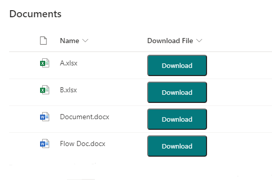

# Download File Button

## Summary

This sample demonstrates adding a button within a document library view which downloads the file.

## View requirements

This format can be applied to any column type (its value is ignored).

## Sample

Solution|Author(s)
--------|---------
generic-download-file-button.json | [Ganesh Sanap](https://github.com/ganesh-sanap) ([@GaneshSanap20](https://twitter.com/GaneshSanap20))

## Version history

Version |Date          |Comments
--------|--------------|--------------------------------
1.0     |January 05, 2022 |Initial release
1.1     |January 07, 2023 |Changed button hide condition.

## Disclaimer

**THIS CODE IS PROVIDED *AS IS* WITHOUT WARRANTY OF ANY KIND, EITHER EXPRESS OR IMPLIED, INCLUDING ANY IMPLIED WARRANTIES OF FITNESS FOR A PARTICULAR PURPOSE, MERCHANTABILITY, OR NON-INFRINGEMENT.**

