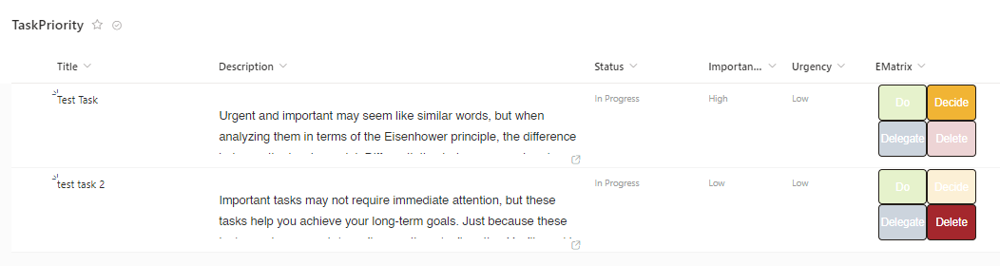

# Task Matrix

## Summary

The Eisenhower Matrix is like a map for managing your tasks. It helps you decide what needs to be done first, what can wait, what can be given to someone else, and what can be left aside. Let's break it down into four boxes: things to do now, things to do later, things to pass on to others, and things to forget about. We'll show you how to use this tool and give you some tips for sorting out your tasks.

Understanding the difference between urgent and important is key here. Urgent means it needs to be done right away. If you ignore urgent tasks, there can be bad consequences, like missing a deadline or causing a bigger problem. These tasks are like fires you need to put out quickly to avoid getting burned out.

For example, finishing a project with a deadline, handling an urgent request from a client, or fixing something broken in your home are all urgent tasks. Now, important tasks might not be urgent, but they're still crucial for reaching your long-term goals. You need to plan for these tasks carefully so you can use your time and energy wisely. This could include planning a big project, meeting new people to grow your business, or just doing regular chores to keep things running smoothly.

## View requirements

The format expects the following fields:

|Type|Internal Name|Notes|
|------|------|------|
|Choice|Importance|Options - High, Low
|Choice|Urgency|Options - High, Low
|Calculated field - Single line of text |EMatrix|Formula - `=IF(AND(Importance<>"",Urgency<>""),IF(Importance="High",2,1)&"."&IF(Urgency="High",2,1),"")` or `=IF(AND(Importance<>"";Urgency<>"");IF(Importance="High";2;1)&"."&IF(Urgency="High";2;1);"")`

> [!NOTE]  
> The delimiter in the formula for the Calculated field is a comma (,) or semi-colon (;), but the available ones depend on the locale of the site. (Reference: [Calculated Field Formulas](https://learn.microsoft.com/previous-versions/office/developer/sharepoint-2010/bb862071(v=office.14)#important-notes)) 

## Sample

Solution|Author(s)
--------|---------
generic-eisenhower-matrix.json | [Larry Pfaff](https://github.com/jaxkookie) ([@jaxkookie](https://twitter.com/jaxkookie))

## Version history

Version|Date|Comments
-------|----|--------
1.0|April 2, 2024|Initial release

## Disclaimer
**THIS CODE IS PROVIDED *AS IS* WITHOUT WARRANTY OF ANY KIND, EITHER EXPRESS OR IMPLIED, INCLUDING ANY IMPLIED WARRANTIES OF FITNESS FOR A PARTICULAR PURPOSE, MERCHANTABILITY, OR NON-INFRINGEMENT.**

