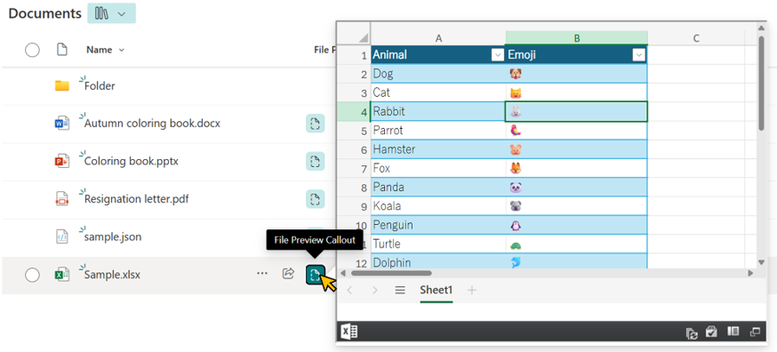
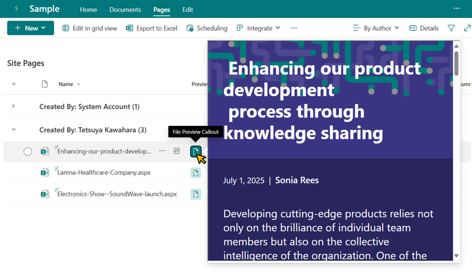

# File Preview Callout with the `embed` Action

## Summary

This sample demonstrates how to display a file preview from a document library or Site Pages inside a callout using the [embed](https://learn.microsoft.com/sharepoint/dev/declarative-customization/formatting-syntax-reference#customrowaction) action. This allows users to view file contents without leaving the current page.

Pages can also be previewed in a callout.

> [!WARNING]
> Support for the `embed` action in Site Pages may not yet be available in some tenants as of October 2, 2025, so page previews might not work in those environments.

## Prerequisites

To embed content, the domain of the SharePoint site (e.g., `contoso.sharepoint.com`) must be allowed for embedding. For guidance on how to allow embedding, please refer to [Allow or restrict the ability to embed content on SharePoint Lists using custom formatters](https://go.microsoft.com/fwlink/p/?linkid=2258033).

If you attempt to embed content from a domain that is not allowed, the following error screen will appear:

## View requirements

- This format is designed for use with document libraries and Site Pages.
- This format can be applied to any column type.

## Sample

Solution|Author(s)
--------|---------
generic-embed-file-preview.json | [Tetsuya Kawahara](https://github.com/tecchan1107)

## Version history

Version |Date         |Comments
--------|-------------|--------
1.0     |June 30, 2025|Initial release
1.1     |October 2, 2025|Extended to support page (aspx) previews

## Disclaimer
**THIS CODE IS PROVIDED *AS IS* WITHOUT WARRANTY OF ANY KIND, EITHER EXPRESS OR IMPLIED, INCLUDING ANY IMPLIED WARRANTIES OF FITNESS FOR A PARTICULAR PURPOSE, MERCHANTABILITY, OR NON-INFRINGEMENT.**

---

## Additional notes

- This sample was created with reference to the [generic-file-preview](../generic-file-preview/).
- Not all file extensions have been tested for preview, so some file types may not be supported for display.
- The embedded view uses query strings such as `?env=WebView`. For more details, see [Query String URL Tricks for SharePoint and Microsoft 365](https://learn.microsoft.com/microsoft-365/community/query-string-url-tricks-sharepoint-m365).

