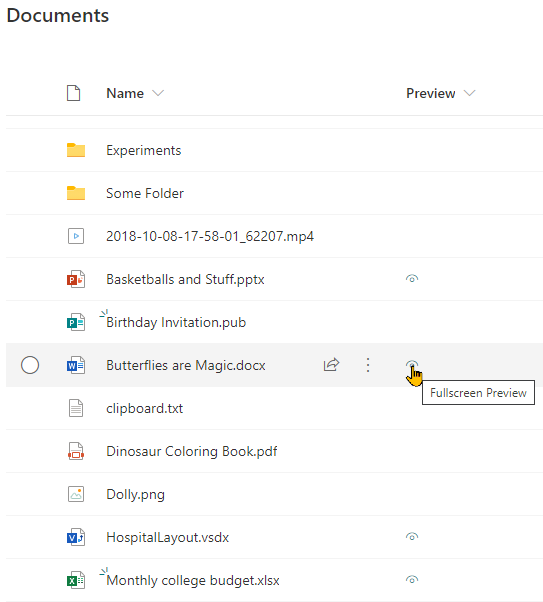

# File Preview

## Summary
This sample opens Microsoft Office documents in full screen within a new tab. This is the same view as used in the fileviewer webpart (no toolbars).

## View requirements
- This format is intended for document libraries
- The format can be applied to any column, although it is recommended to add it to a calculated column with a ="" formula
- Only specific file types are supported (see below)

### Supported File Types

This format relies on `Doc.aspx` which supports the viewing of Microsoft Office documents. The format only displays for the following extensions:

- **Word**: docx, dotx, dotm, docm, docb
- **PowerPoint**: pptx, pptm, potx, potm, ppam, ppsx, ppsm, sldx, sldm
- **Visio**: vsdx
- **Excel**: xlsx, xlsm, xltx, xltm

> This list of extensions can be adjusted by either removing or adding another condition in the `display` style property.

## Sample

Solution|Author(s)
--------|---------
generic-file-preview.json | [Geert de Kooter](https://github.com/gdk-max)

## Version history

Version|Date|Comments
-------|----|--------
1.0|August 08, 2020|Initial release
2.0|January 26, 2022|When the filetype is not of the supported filetypes, it will open in a new window, the icon changes to reflect this behavior.

## Disclaimer
**THIS CODE IS PROVIDED *AS IS* WITHOUT WARRANTY OF ANY KIND, EITHER EXPRESS OR IMPLIED, INCLUDING ANY IMPLIED WARRANTIES OF FITNESS FOR A PARTICULAR PURPOSE, MERCHANTABILITY, OR NON-INFRINGEMENT.**

---

## Additional notes
none

