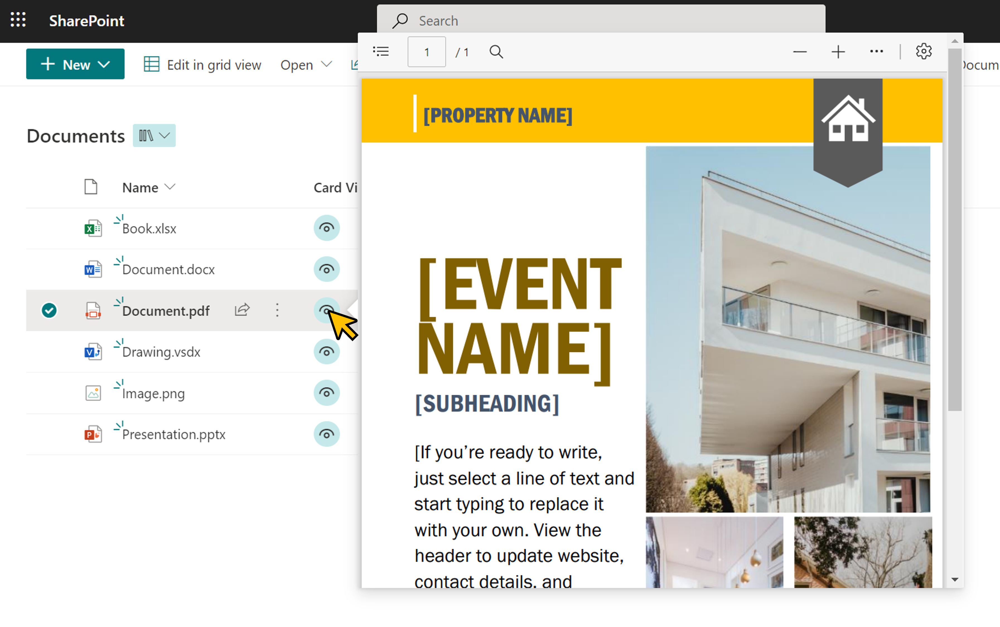

# File View Card

## Summary
This sample demonstrates displaying a file on a custom card. The file is displayed with `filepreview` set to `elmType`.

It can display pages from the Site Pages as well as files from the document library.

## View requirements

- This format is intended for document libraries and Site Pages
- This format can be applied to any column type.

## Sample

Solution                   |Author(s)
---------------------------|---------------------------
generic-file-view-card.json|[Tetsuya Kawahara](https://twitter.com/techan_k)

## Version history

Version |Date         |Comments
--------|-------------|--------
1.0     |May 21, 2022 |Initial release

## Disclaimer
**THIS CODE IS PROVIDED *AS IS* WITHOUT WARRANTY OF ANY KIND, EITHER EXPRESS OR IMPLIED, INCLUDING ANY IMPLIED WARRANTIES OF FITNESS FOR A PARTICULAR PURPOSE, MERCHANTABILITY, OR NON-INFRINGEMENT.**

