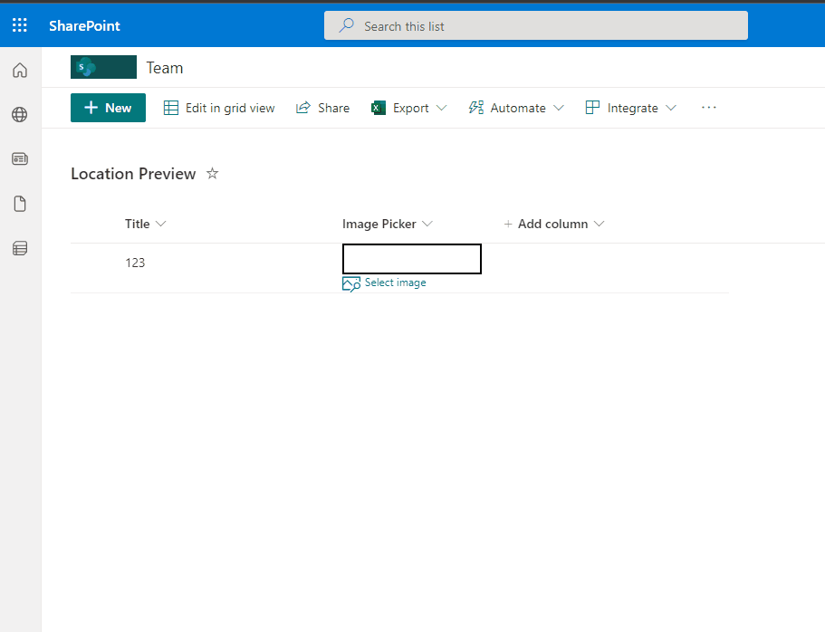

# File Picker

## Summary
This sample demonstrates how to prompt users to copy a file link from a specific library and displays it in the column.

## View requirements
- This format can be applied to any `Single line of Text` Column with Title `FilePicker`.

## Sample

Solution|Author(s)
--------|---------
generic-filepicker.json | [André Lage](https://github.com/aaclage)

- Replace `[replaceUrlPathtoLibrary]` with path to SharePoint Library, sample: '/SiteAssets/'

## Version history

Version|Date|Comments
-------|----|--------
1.0|May 27, 2022|Initial release

## Disclaimer
**THIS CODE IS PROVIDED *AS IS* WITHOUT WARRANTY OF ANY KIND, EITHER EXPRESS OR IMPLIED, INCLUDING ANY IMPLIED WARRANTIES OF FITNESS FOR A PARTICULAR PURPOSE, MERCHANTABILITY, OR NON-INFRINGEMENT.**

---

