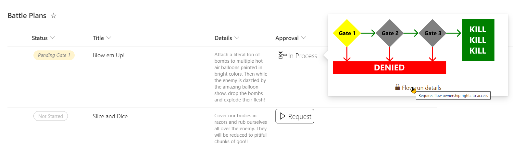
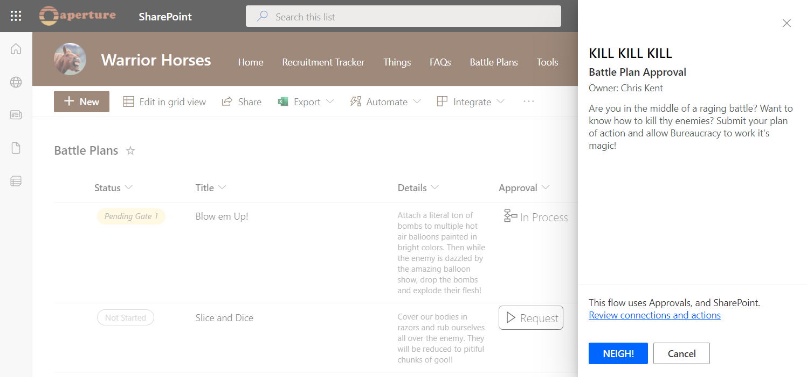
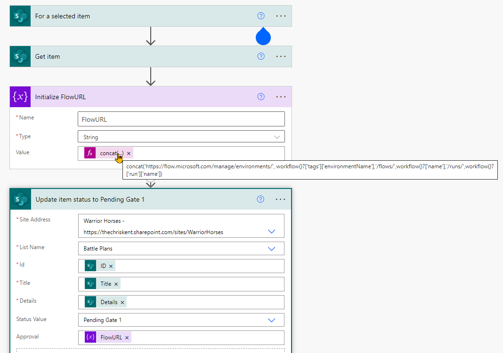

# Flow Status

## Summary



This sample conditionally shows a button to launch a flow. Additional details are provided to customize the flow panel title and button. This provides context to users and is often far more meaningful than the default of "Run Flow" which generally doesn't mean much to end users.



### Power Automate flow instance URL

The associated Power Automate flow uses an expression to build a URL that will point to the exact instance of the flow. This is very helpful for finding exactly which run applies to a list item (the alternative is to open each flow and check the details). The expression used is:

```
concat('https://flow.microsoft.com/manage/environments/', workflow()?['tags']['environmentName'],'/flows/',workflow()?['name'],'/runs/',workflow()?['run']['name’])
```

This expression can be used in any flow.

In this sample, both the status and the flow url are updated (the flow url field is where the format is applied). This allows the format to turn off the launch flow button for items that are already in progress and provide a link to the exact instance for any troubleshooting.



### Flow Diagram

The process status shown in the hover card was created in Visio and saved as an SVG. The [HTML to Formatter](https://pnp.github.io/List-Formatting/tools/html-formatter-generator/) tool was used to quickly convert the SVG into a format and that was adapted to add the conditional logic for fill colors.

## View requirements
- This format expects to be applied to a text column where the value of the field is the flow instance URL (see above).

|Type|Internal Name|Required|
|---|---|:---:|
|Choice|Status|Yes|

The Status column is using these values (but you use different values, just update the format accordingly):
- Not Started
- Pending Gate 1
- Pending Gate 2
- Pending Gate 3
- Approved
- Rejected

## Sample

Solution|Author(s)
--------|---------
generic-flow-status.json | [Chris Kent](https://github.com/thechriskent) ([@thechriskent](https://twitter.com/thechriskent))

## Version history

Version|Date|Comments
-------|----|--------
1.0|April 15, 2022|Initial release

## Disclaimer
**THIS CODE IS PROVIDED *AS IS* WITHOUT WARRANTY OF ANY KIND, EITHER EXPRESS OR IMPLIED, INCLUDING ANY IMPLIED WARRANTIES OF FITNESS FOR A PARTICULAR PURPOSE, MERCHANTABILITY, OR NON-INFRINGEMENT.**

---


