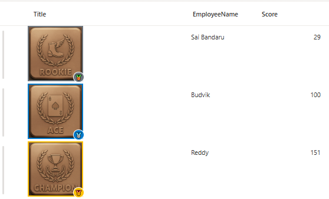

# Gamification Badge Column Formatting

## Summary

This project demonstrates how to create **dynamic Gamification badges** within a SharePoint list using **column formatting JSON**. The badges display different contributor levels based on score values, with **visual indicators, tooltips, and color-coded borders**.

## Features

- **Dynamic Badge Display:** Shows different contributor images based on score ranges
- **Color-Coded Borders:** Visual indication of Gamification level with themed colors
- **Interactive Tooltips:** Hover to see detailed contributor level and score information
- **Medal Badges:** Small emoji indicators showing Gamification tier
- **Responsive Design:** Scales appropriately within SharePoint list columns
- **Score-Based Logic:** Automatically categorizes contributors into tiers

## Gamification Tiers

The badge system categorizes contributors into the following tiers based on their scores:

| Score Range | Level | Border Color | Badge | Image |
|-------------|-------|--------------|-------|--------|
| ≤ 30 | Rookie Contributor | Gray (#6c757d) | 🥉 Bronze | Rookie.png |
| 31-149 | Ace Contributor | Blue (#007acc) | 🥈 Silver | Ace.png |
| > 150 | Champion | Gold (#ffc107) | 🥇 Gold | Champion.png |

## View requirements

This formatting requires the following **columns in your SharePoint list**:

| Column Name | Type | Description |
|-------------|------|-------------|
| Score | Number | Numerical score value for determining Gamification level |
| EmployeeName | Single Line of Text | Employee Name |
| Title | Single Line of Text | Column where the formatting will be applied |

> **Note:** The formatting references the `Score` column to determine which badge to display. Ensure your Score column contains numerical values.

## JSON Column Formatting Features

The JSON formatting includes several advanced features:

- **Conditional Image Loading:** Different images based on score ranges
- **Dynamic Styling:** Border colors and background colors change based on Gamification level
- **Hover Tooltips:** Interactive `title` attribute shows "Level - Score: X"
- **Badge Overlay:** Small circular badge in bottom-right corner with achievement emoji
- **Flexible Sizing:** 100x100px images with responsive borders

## How to Apply

1. **Prepare Your List:**
   - Ensure you have a **Score** column (Number type)
   - Have the images uploaded to your SharePoint site assets

2. **Apply Column Formatting:**
   - Open your **SharePoint list**
   - Click the column **Title** header → **Column settings → Format this column**
   - Switch to **Advanced mode**
   - Paste the provided JSON into the formatting editor
   - Click **Save**

3. **Image Setup:**
   - Upload your achievement images to Site Assets:
     - `Rookie.png` - For rookie and default contributors
     - `Ace.png` - For ace contributors  
     - `Champion.png` - For champions
   - Update the URLs in the JSON to match your site path

## Troubleshooting

### Images Not Loading
- Verify image URLs are accessible to all users
- Check SharePoint permissions on Site Assets library
- Ensure image file names match exactly (case-sensitive)

### Formatting Not Applied  
- Confirm Score column is Number type
- Check column references match exact column names
- Validate JSON syntax using online JSON validators

### Tooltips Not Showing
- Ensure browser allows tooltips
- Check if custom CSS is interfering
- Verify `title` attribute is not being overridden

## Performance Considerations

- **Image Optimization:** Use optimized PNG/JPG files (recommended: <100KB each)
- **Caching:** SharePoint automatically caches images for better performance
- **Column Limit:** Works efficiently with hundreds of rows

## Security Notes

- Images are served through SharePoint's security context
- No external dependencies or third-party resources required
- All logic is processed client-side through SharePoint's JSON engine

## Sample

Solution|Author(s)
--------|---------
generic-gamification.json | [Sai Bandaru](https://github.com/saiiiiiii)

## Version History

Version|Date|
-------|----|
1.0|September 26, 2025|

## Disclaimer
**THIS CODE IS PROVIDED *AS IS* WITHOUT WARRANTY OF ANY KIND, EITHER EXPRESS OR IMPLIED, INCLUDING ANY IMPLIED WARRANTIES OF FITNESS FOR A PARTICULAR PURPOSE, MERCHANTABILITY, OR NON-INFRINGEMENT.**

## References

- [SharePoint Column Formatting Documentation](https://learn.microsoft.com/sharepoint/dev/declarative-customization/column-formatting)
- [JSON Schema for SharePoint Column Formatting](https://developer.microsoft.com/json-schemas/sp/v2/column-formatting.schema.json)
- [SharePoint List Formatting Examples](https://pnp.github.io/List-Formatting/)

