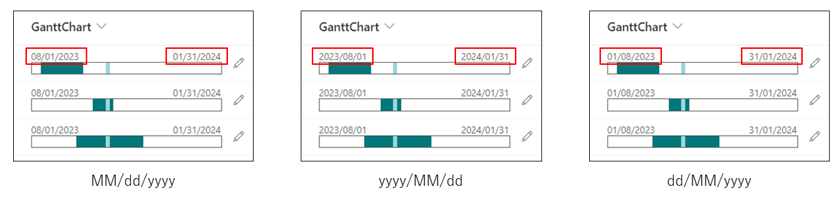

# Gantt Chart

## Summary
This sample demonstrates the use of the Calculated column to generate a string for displaying a Gantt chart, and then parses the string to display the Gantt chart. The start and end dates for the entire Gantt chart can be changed to any value by changing the formula in the Calculated Value column.


Additionally, you can adjust the date format displayed on the Gantt chart by combining JSON and the corresponding formulas. Refer to the table below for date format options and the associated JSON and formulas:

| Date Format | JSON File                         | Formula for GanttChart Column |
| ----------- | --------------------------------- | ----------------------------- | 
| MM/dd/yyyy  | generic-gantt-chart.json          | Formula1 or Formula3          | 
| yyyy/MM/dd  | generic-gantt-chart.json          | Formula2 or Formula4          | 
| dd/MM/yyyy  | generic-gantt-chart-ddMMyyyy.json | Formula2 or Formula4          | 



## View requirements

|Type                             |Internal Name|Required|
|---------------------------------|-------------|:------:|
|Date and time                    |Start        |Yes     |
|Date and time                    |End          |Yes     |
|Calculated (Single line of text) |GanttChart   |Yes     |

Set one of the following formulas for the `GanttChart` column.
```
[Formula1]
=TEXT([Start],"MM-dd-yyyy")&"^"&TEXT([End],"MM-dd-yyyy")&"(【Overall start date of the Gantt chart (in MM-dd-yyyy format)】_【Overall end date of the Gantt chart (in MM-dd-yyyy format)】)"

[Formula1 Sample]
=TEXT([Start],"MM-dd-yyyy")&"^"&TEXT([End],"MM-dd-yyyy")&"(08-01-2023_01-31-2024)"
```

```
[Formula2]
=TEXT([Start],"yyyy-MM-dd")&"^"&TEXT([End],"yyyy-MM-dd")&"(【Overall start date of the Gantt chart (in yyyy-MM-dd format)】_【Overall end date of the Gantt chart (in yyyy-MM-dd format)】)"

[Formula2 Sample]
=TEXT([Start],"yyyy-MM-dd")&"^"&TEXT([End],"yyyy-MM-dd")&"(2023-08-01_2024-01-31)"
```


**Note**  
[Depending on the site settings, the parameter delimiter in the Calculated column may be a ; (semi-colon) instead of a , (comma).](https://learn.microsoft.com/previous-versions/office/developer/sharepoint-2010/bb862071(v=office.14)#important-notes) If the parameter delimiter is incorrect, an error screen will appear after creating or editing the Calculated column. If the site uses ; (semi-colon) as the parameter delimiter, please use the following formula.
```
[Formula3]
=TEXT([Start];"MM-dd-yyyy")&"^"&TEXT([End];"MM-dd-yyyy")&"(【Overall start date of the Gantt chart (in MM-dd-yyyy format)】_【Overall end date of the Gantt chart (in MM-dd-yyyy format)】)"

[Formula3 Sample]
=TEXT([Start];"MM-dd-yyyy")&"^"&TEXT([End];"MM-dd-yyyy")&"(08-01-2023_01-31-2024)"
```

```
[Formula4]
=TEXT([Start];"yyyy-MM-dd")&"^"&TEXT([End];"yyyy-MM-dd")&"(【Overall start date of the Gantt chart (in yyyy-MM-dd format)】_【Overall end date of the Gantt chart (in yyyy-MM-dd format)】)"

[Formula4 Sample]
=TEXT([Start];"yyyy-MM-dd")&"^"&TEXT([End];"yyyy-MM-dd")&"(2023-08-01_2024-01-31)"
```

## Sample

Solution|Author(s)
--------|---------
generic-gantt-chart.json | [Tetsuya Kawahara](https://github.com/tecchan1107) ([@techan_k](https://twitter.com/techan_k))

## Version history

Version |Date              |Comments
--------|------------------|--------------------------------
1.0     |September 27, 2023|Initial release
1.1     |October 12, 2023|Added note on delimiter character in Calculated column
1.2     |October 13, 2023|Added more options for date format displayed on Gantt chart

## Disclaimer
**THIS CODE IS PROVIDED *AS IS* WITHOUT WARRANTY OF ANY KIND, EITHER EXPRESS OR IMPLIED, INCLUDING ANY IMPLIED WARRANTIES OF FITNESS FOR A PARTICULAR PURPOSE, MERCHANTABILITY, OR NON-INFRINGEMENT.**

---

## Additional notes

- Calculated columns can be added from [See all column types] on the Create Column screen.

    


