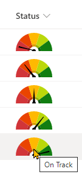

# Generic Gauge

## Summary
This sample demonstrates combining a fixed SVG (gauge background) with a dynamic SVG (needle). The values are based on text values (choice or text).

> This sample is an adaptation of the [number-gauge](../number-gauge/) sample that shows how to represent a percent column with a dynamic gauge.

## View requirements

This format can be applied to any column. As written, it is expecting the values to be one of the following:
- Critical
- Off Track
- At Risk
- Some Concerns
- On Track

To use custom values, simply to a find and replace with your equivalent values.

## Sample

Solution|Author(s)
--------|---------
generic-gauge.json | [Chris Kent](https://github.com/thechriskent)

## Version history

Version|Date|Comments
-------|----|--------
1.0|April 26, 2022|Initial release

## Disclaimer
**THIS CODE IS PROVIDED *AS IS* WITHOUT WARRANTY OF ANY KIND, EITHER EXPRESS OR IMPLIED, INCLUDING ANY IMPLIED WARRANTIES OF FITNESS FOR A PARTICULAR PURPOSE, MERCHANTABILITY, OR NON-INFRINGEMENT.**

---

## Additional notes

- [Use column formatting to customize SharePoint](https://docs.microsoft.com/en-us/sharepoint/dev/declarative-customization/column-formatting)

