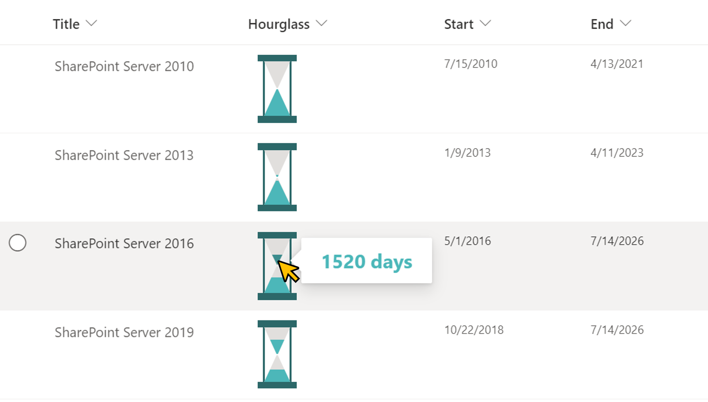

# Display Hourglass

## Summary
This sample demonstrates displaying an hourglass. Sand begins to fall when it is time for the `Start` column, and all sand falls when it is time for the `End` column. Also, when you hover the mouse over the sand, the number of days is displayed.

## View requirements
This format can be applied to any column type but expects the following columns to be part of the view:

|Type          |Internal Name |Required|
|--------------|--------------|:------:|
|Date and Time |Start         |Yes     |
|Date and Time |End           |Yes     |

## Sample

Solution|Author(s)
--------|---------
generic-hourglass.json | [Tetsuya Kawahara](https://github.com/tecchan1107) ([@techan_k](https://twitter.com/techan_k))

## Version history

Version |Date         |Comments
--------|-------------|----------------
1.0     |May 15, 2022 |Initial release

## Disclaimer
**THIS CODE IS PROVIDED *AS IS* WITHOUT WARRANTY OF ANY KIND, EITHER EXPRESS OR IMPLIED, INCLUDING ANY IMPLIED WARRANTIES OF FITNESS FOR A PARTICULAR PURPOSE, MERCHANTABILITY, OR NON-INFRINGEMENT.**

