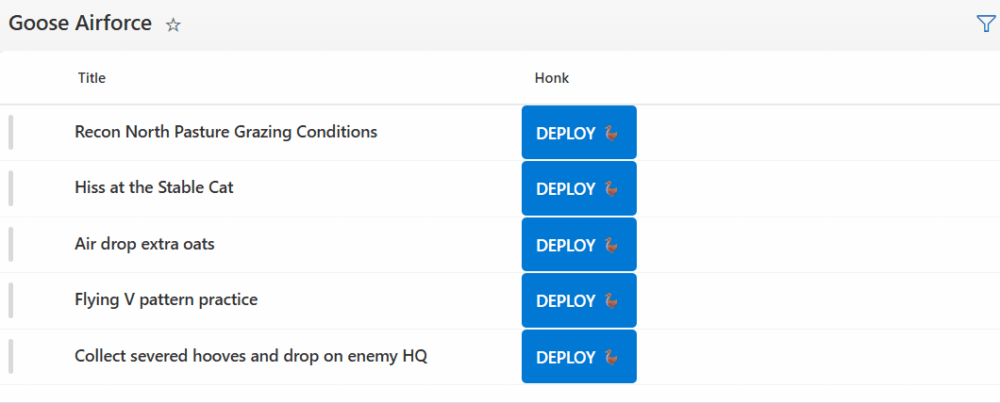

# Instant Flow Trigger with HTML Response via Embed Action

## Summary
This sample demonstrates how to trigger a Power Automate flow instantly from a list button without the standard "Run Flow" side-pane friction.

It uses the `customRowAction` with `action: "embed"` to hit a Power Automate **HTTP Request (GET)** endpoint. The Flow returns an HTML payload that renders directly inside the (embedded) formatting callout bubble.

## View requirements
* This formatting can be applied to any column type (Text, Calculated, etc.).

## Sample

Solution|Author(s)
--------|---------
generic-http-flow-response.json  | [Sam Yost](https://github.com/samyost)

## Version history

Version|Date|Comments
-------|----|--------
1.0|November 23, 2025|Initial release

## Disclaimer

**THIS CODE IS PROVIDED *AS IS* WITHOUT WARRANTY OF ANY KIND, EITHER EXPRESS OR IMPLIED, INCLUDING ANY IMPLIED WARRANTIES OF FITNESS FOR A PARTICULAR PURPOSE, MERCHANTABILITY, OR NON-INFRINGEMENT.**

---

## Additional notes

### Flow Configuration
This pattern relies on a specific Power Automate configuration to function correctly within the SharePoint callout bubble.

**1. The Trigger**
* Create an Instant Cloud Flow using the **"When an HTTP request is received"** trigger.
* **Method:** Set to **GET** (found in "Advanced options").
* **Who can trigger:** Set to **"Anyone"** (for public SAS URL) or **"Any user in my tenant"**.
    * *Note: "Anyone" provides the smoothest UX as it bypasses potential sign-in redirects inside the bubble.*

**2. The Response**
* The Flow must end with a **Response** action.
* **Status Code:** 200
* **Headers:** `Content-Type`: `text/html; charset=utf-8`
* **Body:** Include the HTML you want displayed in the bubble (e.g., `<b>✅ Success</b>`).

### Troubleshooting
**"Content not allowed" or "Refused to connect"**
If the callout bubble appears but displays an error message, your SharePoint environment may be blocking external iframes (including Azure Logic Apps domains).

To fix this:
1. Go to **Site Settings** > **HTML Field Security** (under Site Collection Administration).
2. Add the domain of your Flow URL to the list (e.g., `logic.azure.com` or `prod-18.westus.logic.azure.com`).
3. Click **OK**.

