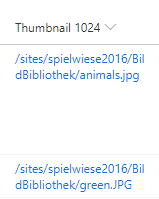

# File Thumbnails or Hyperlinks

## Summary
This example uses a column to generate a hyperlink to the Item Thumbnail for a document library.
* Uses FileRef Variable
* Uses getpreview.ashx

### Before you use generic-hyperlink-thumbnail
* Adjust the resolution=**3** (0-6) value to your NEEDS. _(3: 1024px, 4: 1600px)_

### generic-image-thumbnail 
basics from: https://github.com/pnp/List-Formatting/tree/master/column-samples/picture-roundimage-format

* Adjust Thumbnail Sizes or Rounded Edges to your NEEDS. 

## View requirements
- This format can be applied to any column type (the value is ignored)
- This format should be used in a Document Library

## Sample

Solution|Author(s)
--------|---------
generic-hyperlink-thumbnail.json | [Josef Lahmer](https://github.com/josy1024)
generic-image-thumbnail.json | [Josef Lahmer](https://github.com/josy1024)

## Version history

Version|Date|Comments
-------|----|--------
1.0|July 17, 2018 |Initial release
1.1|August 20, 2018|Switched to Excel-style expressions
1.2|January 9, 2019|Removed hardcoded url and replaced with @currentWeb token
1.3|April 9, 2019|Bug fix in @currentWeb, + generic-image-thumbnail

## Disclaimer
**THIS CODE IS PROVIDED *AS IS* WITHOUT WARRANTY OF ANY KIND, EITHER EXPRESS OR IMPLIED, INCLUDING ANY IMPLIED WARRANTIES OF FITNESS FOR A PARTICULAR PURPOSE, MERCHANTABILITY, OR NON-INFRINGEMENT.**

---

## Additional notes
- [Use column formatting to customize SharePoint](https://docs.microsoft.com/en-us/sharepoint/dev/declarative-customization/column-formatting)

> An additional version using Abstract Tree Syntax (AST) is also provided for environments where the Excel-style expressions are not supported.

