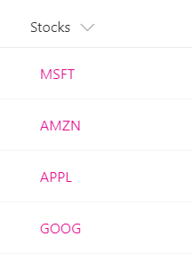

# Turn field values into hyperlinks

## Summary
This example shows how to turn a text field that contains stock ticker symbols into a hyperlink that targets the Yahoo Finance real-time quotes page for that stock ticker. The example uses a `+` operator that appends the current field value to the static hyperlink <a>http://finance.yahoo.com/quote/</a>. You can extend this pattern to any scenario in which you want users to view contextual information related to an item, or you want to start a business process on the current item, as long as the information or process can be accessed via a hyperlink parameterized with values from the list item.

## View requirements
- This format can be applied to any column type

## Sample

Solution|Author(s)
--------|---------
generic-hyperlink-values.json | SharePoint Team

## Version history

Version|Date|Comments
-------|----|--------
1.0|November 2, 2017|Initial release
1.1|August 20, 2018|Switched to Excel-style expressions

## Disclaimer
**THIS CODE IS PROVIDED *AS IS* WITHOUT WARRANTY OF ANY KIND, EITHER EXPRESS OR IMPLIED, INCLUDING ANY IMPLIED WARRANTIES OF FITNESS FOR A PARTICULAR PURPOSE, MERCHANTABILITY, OR NON-INFRINGEMENT.**

---

## Additional notes
This sample is also covered in the main documentation around Column Formatting

- [Use column formatting to customize SharePoint](https://docs.microsoft.com/en-us/sharepoint/dev/declarative-customization/column-formatting)

> An additional version using Abstract Tree Syntax (AST) is also provided for environments where the Excel-style expressions are not supported.

