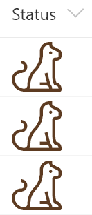
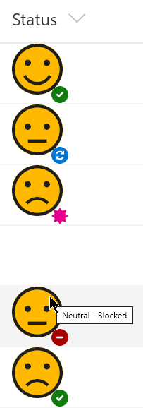

# Icon Overlays  

## Summary
You can UI Fabric Icons within your column and view formats. This sample demonstrates combining multiple icons by overlaying to create colorful icons that can indicate more information than a single icon can.

Overlays are done by using a parent element with a `style` -> `position` value of `relative`. Then we can have the child elements use a `position` value of `absolute` to precisely overlay the icons where we want them.

### generic-icon-overlay.json

This sample demonstrates using a solid icon (HeartFill) to provide a colored background to our icon and overlaying a wireframe icon to create an outline. The icons are shown conditionally based on the value. Using this technique with the various Solid, Mask, and Fill icons available can create far more icons than are currently available and allows more precise control of the coloring.

#### View requirements
- This format expects to be applied to a text or choice column with the following values:
  - Positive
  - Negative
  - Neutral

### simple-icon.json

This is a very basic sample that simply displays a Cat icon and is helpful for demonstrating how to display an icon and set it's size and color. The icon and color are NOT conditionally set (see the other files in this sample for examples of that). In this case, the theme color has been applied with a class but it could just as easily have been set using the `style` -> `color` property.

#### View requirements
- This format can be applied to any column type (the value is ignored)

### generic-icon-overlay-multiple

#### View requirements
- This format expects to be applied to a text or choice column with the following values:
  - In progress
  - In review
  - Done
  - Blocked
- An additional column with an internal name of Sentiment (text or choice) is expected with the following values:
  - Positive
  - Negative
  - Neutral

## Sample

Solution|Author(s)
--------|---------
generic-icon-overlay.json | [Chris Kent](https://github.com/thechriskent)
simple-icon.json | [Chris Kent](https://github.com/thechriskent)
generic-icon-overlay-multiple.json | [Chris Kent](https://github.com/thechriskent)

## Version history

Version|Date|Comments
-------|----|--------
1.0|January 9, 2020|Initial release

## Disclaimer
**THIS CODE IS PROVIDED *AS IS* WITHOUT WARRANTY OF ANY KIND, EITHER EXPRESS OR IMPLIED, INCLUDING ANY IMPLIED WARRANTIES OF FITNESS FOR A PARTICULAR PURPOSE, MERCHANTABILITY, OR NON-INFRINGEMENT.**

---

