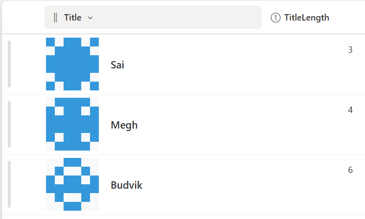

# Identicon Column Formatting

This sample demonstrates how to use **SharePoint Column Formatting** to generate **Identicons** for list items.  
Each identicon is a small visual grid that represents the `Title` of the item, making it easier to identify items at a glance.



---

## Sample Overview

- Identicons are **6x7 grids of colored squares**.
- Colors are generated based on a calculated **TitleLength** column.
- Works in **modern SharePoint list views**.
- Displayed alongside the **Title** column for quick identification.

---

## List Requirements

Create a SharePoint list with the following columns:

| Internal Name   | Type                     |
|-----------------|--------------------------|
| **Title**       | Single line of text      |
| **TitleLength** | Calculated (Number)      |

> **TitleLength formula:**  
> ```
> =LEN([Title])
> ```  
> This calculates the number of characters in the `Title` and is used to generate the identicon pattern.

---

## Sample Data

| Title          | TitleLength |
|----------------|------------|
| Sai            | 3         |
| Megh           | 2         |
| Budvik         | 5         |

The identicon pattern automatically updates based on `TitleLength`.

---

## How It Works

- Each square in the identicon grid is colored using a formula based on `TitleLength`.
- Squares change between two colors to produce a unique visual pattern.
- Supports **light and dark SharePoint themes**.
- Ideal for **list views** where quick visual identification is needed.

---

## Sample

Solution|Author
--------|---------
generic-identicon.json | [Sai Bandaru](https://github.com/saiiiiiii) ([LinkedIn](https://www.linkedin.com/in/sai-bandaru-97a946153/))

---

## Version History

| Version | Date       | Comments           |
|---------|------------|------------------|
| 1.0     | August 25, 2025 | Initial release |

---

## Disclaimer
**THIS CODE IS PROVIDED *AS IS* WITHOUT WARRANTY OF ANY KIND, EITHER EXPRESS OR IMPLIED, INCLUDING ANY IMPLIED WARRANTIES OF FITNESS FOR A PARTICULAR PURPOSE, MERCHANTABILITY, OR NON-INFRINGEMENT.**

---

## Additional Notes

- Adjust colors or square size by editing the `identicon-column.json`.
- Works best in modern SharePoint lists sorted by Title or other relevant columns.