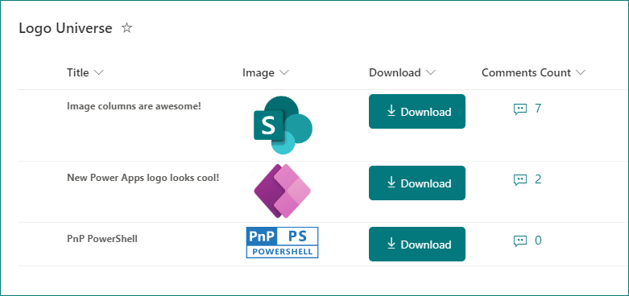

# Download Image from SharePoint Image column

## Summary

This sample demonstrates adding a button within a SharePoint Online/Microsoft Lists view which downloads the image from image column.

## View requirements

This format can be applied to any column type (its value is ignored). However, it is expected that the following one column is part of the view.

|Type  |Internal Name |Required|
|------|--------------|:------:|
|Image |Image         |No      |

## Sample

Solution|Author(s)
--------|---------
image-download.json | [Ganesh Sanap](https://github.com/ganesh-sanap) ([@GaneshSanap20](https://twitter.com/GaneshSanap20))

## Version history

Version |Date          |Comments
--------|--------------|--------------------------------
1.0     |November 12, 2022 |Initial release

## Disclaimer

**THIS CODE IS PROVIDED *AS IS* WITHOUT WARRANTY OF ANY KIND, EITHER EXPRESS OR IMPLIED, INCLUDING ANY IMPLIED WARRANTIES OF FITNESS FOR A PARTICULAR PURPOSE, MERCHANTABILITY, OR NON-INFRINGEMENT.**

