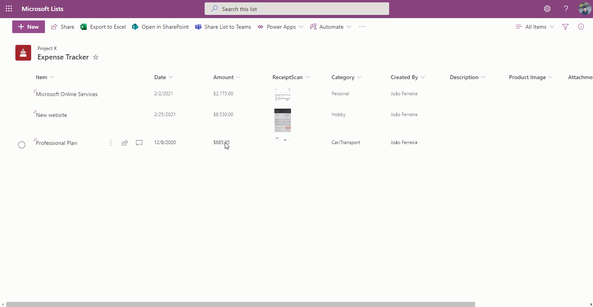

# Image Lightbox

## Summary
This sample demonstrates showing the full size image in a lightbox (hover card) rather than opening this image in a new window.

## View requirements
- This format can be applied to any image column type (Note: this sample does not work with the Picture column type)

## Sample

Solution|Author(s)
--------|---------
image-lightbox.json | [João Ferreira](https://twitter.com/Joao12Ferreira)

## Version history

Version|Date|Comments
-------|----|--------
1.0|February 10, 2020|Initial release

## Disclaimer
**THIS CODE IS PROVIDED *AS IS* WITHOUT WARRANTY OF ANY KIND, EITHER EXPRESS OR IMPLIED, INCLUDING ANY IMPLIED WARRANTIES OF FITNESS FOR A PARTICULAR PURPOSE, MERCHANTABILITY, OR NON-INFRINGEMENT.**

<img src="https://telemetry.sharepointpnp.com/sp-dev-list-formatting/column-samples/image-lightbox" /