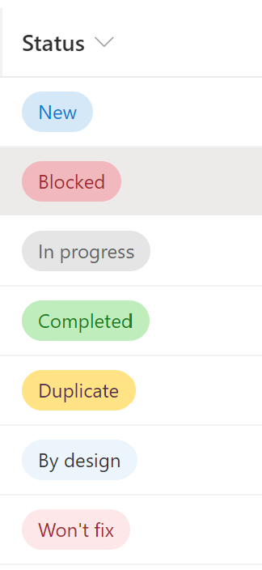

# Issue Status Pill 

## Summary
This format demonstrates how you can reproduce the status choices as pills found in the Microsoft Lists Issue Tracker template..

You can use this formatting to implement your own version of the *choices as pills* formatting.

## View requirements
- This format can be applied to any text/choice column, but expects the column values to be one of the following choices:
  - Blocked
  - In progress
  - Completed
  - Duplicate
  - By design
  - Won't fix
  - New

## Sample

Solution|Author(s)
--------|---------
generic-issuestatus-pill.json | [Hugo Bernier](https://twitter.com/bernierh)

## Version history

Version|Date|Comments
-------|----|--------
1.0|July 30, 2020|Initial release

## Disclaimer
**THIS CODE IS PROVIDED *AS IS* WITHOUT WARRANTY OF ANY KIND, EITHER EXPRESS OR IMPLIED, INCLUDING ANY IMPLIED WARRANTIES OF FITNESS FOR A PARTICULAR PURPOSE, MERCHANTABILITY, OR NON-INFRINGEMENT.**

---

## Additional notes

- [Use column formatting to customize SharePoint](https://docs.microsoft.com/en-us/sharepoint/dev/declarative-customization/column-formatting#me)

