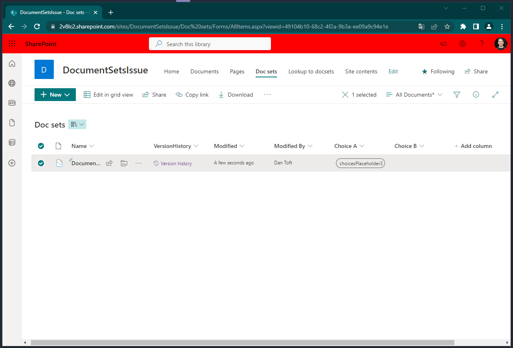
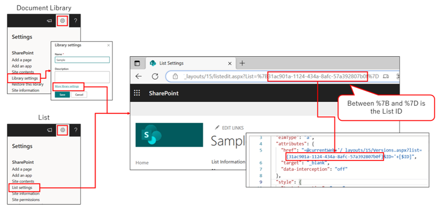

# Item Version History

## Summary
Since document sets rely on a different style of version history (captured versions) - sometimes you want to see how the metadata has changed over time, using the Versions.aspx page over the DocSetVersions.aspx works awesome, but this is also really useful just to make the version history for someone.

> [!NOTE]  
> If you use this sample, you need to set the __LIST ID__. If not set, the link will not work.
> 

## View requirements

- This format can be applied to any column type, I used a calculated field with the _=""_ formula.

## Sample

Solution|Author(s)
--------|---------
generic-item-version-history.json | [Dan Toft](https://github.com/Tanddant)

## Version history

| Version | Date         | Comments        |
| ------- | ------------ | --------------- |
| 1.0     | May 12, 2023 | Initial release |

## Disclaimer

**THIS CODE IS PROVIDED *AS IS* WITHOUT WARRANTY OF ANY KIND, EITHER EXPRESS OR IMPLIED, INCLUDING ANY IMPLIED WARRANTIES OF FITNESS FOR A PARTICULAR PURPOSE, MERCHANTABILITY, OR NON-INFRINGEMENT.**

