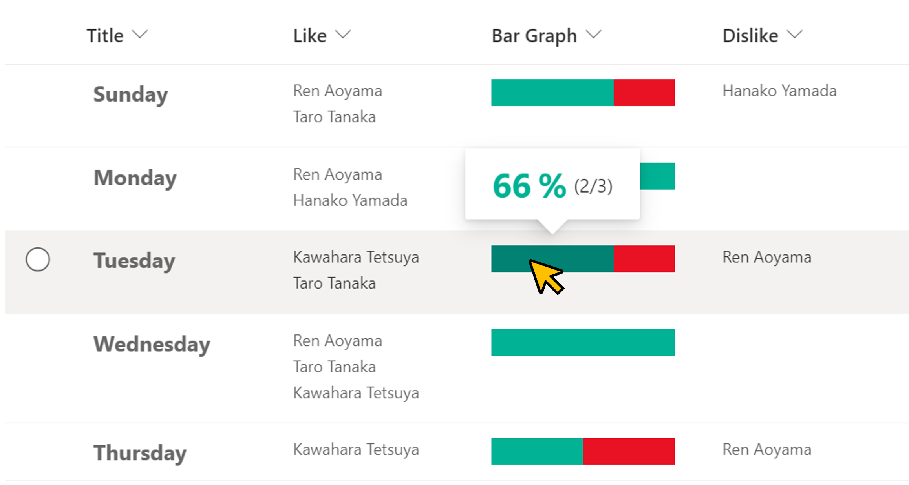

# Like/Dislike Bar

## Summary
This sample demonstrates displaying a Like/Dislike bar that visualizes the ratio of Like to Dislike users.

Using [multi-person-like-or-dislike-unique-reaction](./../multi-person-like-or-dislike-unique-reaction), you can implement Like and Dislike buttons.

## View requirements
This format can be applied to any column type but expects the following columns to be part of the view:

|Type                 |Internal Name  |Required|
|---------------------|---------------|:------:|
|Multi-Select Person  |Like           |No      |
|Multi-Select Person  |Dislike        |No      |

## Sample

Solution                      |Author(s)
------------------------------|---------------------------
generic-like-dislike-bar.json |[Tetsuya Kawahara](https://twitter.com/techan_k)

## Version history

Version |Date           |Comments
--------|---------------|--------
1.0     |March 20, 2022 |Initial release

## Disclaimer
**THIS CODE IS PROVIDED *AS IS* WITHOUT WARRANTY OF ANY KIND, EITHER EXPRESS OR IMPLIED, INCLUDING ANY IMPLIED WARRANTIES OF FITNESS FOR A PARTICULAR PURPOSE, MERCHANTABILITY, OR NON-INFRINGEMENT.**

